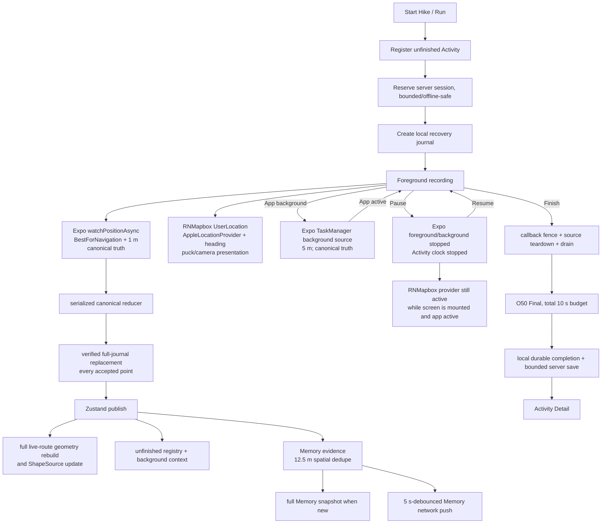

# ACTIVITY ENERGY / PERFORMANCE VERDICT

**Verdict: BLOCKER.** This is an architecture/static-runtime verdict, not a claim about a measured battery percentage. Hike and Run preserve the frozen O50/O51 tracking contracts, but the current Internal/runtime path contains avoidable work substantial enough that today's outing cannot be treated as an energy-acceptance test:

1. foreground Activity runs two native location-provider stacks, and the RNMapbox presentation provider remains active while Cairn is paused;
2. every accepted canonical point rewrites, rereads, validates and swaps the complete Activity journal;
3. Internal QA logging can rewrite its complete bounded log on each accepted point and can upload a complete snapshot every two minutes;
4. accepted points also rewrite small recovery records, while newly explored Memory evidence forces a complete Memory snapshot and schedules live Memory sync.

The tester may still perform the planned walk for route, lifecycle and product validation, and it will provide a useful *known-inefficient baseline*. It must not be used to conclude that energy behavior is healthy. If the purpose is energy acceptance, fix the duplicate presentation provider and journal/QA write amplification first.

**Code change:** none. No cadence, accuracy, canonical reduction, background truth, Stationary V2, O50 Final, Memory semantics, UI, or tracking ownership was changed. No OTA was created or published.

## Method and platform principle

This audit traced the real Hike and Run path from Start through Detail, inspected the installed RNMapbox implementation rather than component names alone, reviewed current O44 native cadence evidence, and ran the focused ownership/lifecycle/presentation tests. It deliberately did not reopen frozen route-quality decisions.

Continuous BestForNavigation recording is expected to cost energy. The relevant question is whether Cairn adds avoidable work around it. Apple's current guidance says high location accuracy may activate additional power-hungry subsystems, location updates should stop when they are no longer needed, and unnecessary file I/O should be batched rather than repeatedly rewriting a whole file. The Mapbox user-location stack is itself a location/heading provider, not a passive rendering of Expo coordinates.

External authority:

- [Apple: Accessing the device's location efficiently](https://developer.apple.com/documentation/xcode/accessing-the-device-s-location-efficiently)
- [Apple Energy Efficiency Guide: Fundamental Concepts](https://developer.apple.com/library/archive/documentation/Performance/Conceptual/EnergyGuide-iOS/FundamentalConcepts.html)
- [Apple Energy Efficiency Guide: Minimize I/O](https://developer.apple.com/library/archive/documentation/Performance/Conceptual/EnergyGuide-iOS/MinimizeIO.html)
- [Mapbox Maps SDK: User location](https://docs.mapbox.com/ios/maps/guides/user-location/)
- [Mapbox `AppleLocationProvider`](https://docs.mapbox.com/ios/maps/api/latest/documentation/mapboxmaps/applelocationprovider/)
- [RNMapbox `UserLocation`](https://rnmapbox.github.io/docs/components/UserLocation)

## Runtime ownership



### Ownership by lifecycle state

| State | Canonical location owner | Presentation location | Other active work | Finding |
| --- | --- | --- | --- | --- |
| Start/requesting | source is acquired only after durable/server setup | Map screen may already be mounted | registry, session reservation, journal init | guarded against double Start |
| Foreground recording | Expo `watchPositionAsync`, BestForNavigation, production 1 m distance filter | RNMapbox singleton `AppleLocationProvider`; separate heading observer | map, camera, route, React, recovery, Memory, QA | **two native location stacks** |
| Background/screen locked | Expo TaskManager background source, 5 m | RNMapbox JS manager stops on background and restarts on active | headless reducer/journal/Memory/QA | intended single canonical source; native measurement still needed to prove invisible GPU suspension |
| Paused, app active | Expo foreground and background are stopped | RNMapbox remains mounted/visible and therefore running | low-rate monitors/timers remain; token refresh allows paused | **presentation location/heading has no pause reason** |
| Resume | new owner generation/segment; exactly one Expo foreground or background source | RNMapbox still present | timer/listener reconstruction is idempotent | canonical handoff is sound |
| Finish processing | Expo sources and Activity AppState listener are fenced/stopped first | RNMapbox remains until Activity screen unmount/navigation | O50 Final, Memory reconciliation, serialization/save | presentation provider can outlive recording during Finish |
| Detail/unmount | none | `UserLocation` listener removed on unmount | sync daemon may finish pending save | teardown completes |

## Location ownership

### Definitive answer

**Normal foreground Hike: two simultaneously active native Core Location client/provider stacks. Normal foreground Run: the same two.**

- **Truth provider:** Expo Location in `useTrackingStore.ts`, explicitly `Accuracy.BestForNavigation` with the O44/O51 production 1 m distance filter. Only this path enters Cairn's canonical reducer.
- **Puck/camera provider:** `HikingMap.tsx` is shared by Hike and Run and always mounts RNMapbox `UserLocation` as visible. The installed component starts its singleton location manager whenever `visible` or `onUpdate` is set and defaults `minDisplacement` to zero.
- **Heading provider:** the installed iOS RNMapbox module creates its own `AppleLocationProvider` and registers both a location observer and a heading observer. Cairn's Expo callback also receives course, but Cairn does not start a separate Expo heading watcher.
- **Simulator:** replaces the Expo truth source and renders a synthetic ShapeSource puck; the duplicate real-provider finding concerns real Activities.

This does **not** assert that iOS energizes two independent GPS radios—Core Location may coalesce hardware work. It proves two native location clients with duplicated callback/bridge/state work, one of which exists only for presentation. Cairn does not configure the Mapbox provider's desired accuracy, so it cannot prove the second client is cheap. Historical O44 native evidence is stronger than speculation: Cairn raw callbacks measured p50/p95 1/2 seconds and RNMapbox callbacks p50/p95 1/1 seconds, with paired callbacks commonly 0–1 ms apart (`docs/review/o44-location-cadence/O44_TRUE_1M_FORENSIC.md`).

Key source evidence:

- `app/src/store/useTrackingStore.ts:4827-4972`
- `app/src/screens/HikingMap.tsx:961-995`
- `app/node_modules/@rnmapbox/maps/src/components/UserLocation.tsx:137-233`
- `app/node_modules/@rnmapbox/maps/src/modules/location/locationManager.ts:130-218`
- `app/node_modules/@rnmapbox/maps/ios/RNMBX/RNMBXLocationModule.swift:132-266`

### Canonical foreground/background ownership

The Cairn-owned side is substantially correct. Foreground activation first stops the native background task, removes an existing watcher, then starts one watcher. Background transition removes foreground ownership before starting TaskManager. A serialized activation chain, durable owner generation, acceptance fence, and point-ingest tail prevent duplicated or late callbacks from becoming truth. Pause and Finish durably disable the lease and drain committed background work. The focused lifecycle tests confirm these contracts.

The RNMapbox singleton is outside this ownership plan. It automatically stops on `AppState=background` and restarts on `active`, but Pause does not change AppState and does not hide/unmount `UserLocation`. That is the clearest unnecessary paused-state power cost.

## Runtime cost

### GPS

- Required: one BestForNavigation/1 m Expo foreground source; one 5 m background TaskManager source when background authorization exists.
- Waste: an independent RNMapbox Apple location + heading provider for visible puck/camera presentation.
- A one-shot Balanced fix is requested only after foreground return when canonical GPS has been stale for more than 60 seconds. This is recovery, not a loop.
- No obsolete second Expo watcher was found; source handoffs are serialized and tested.

### Mapbox

- The map is intentionally the Activity environment while visible. Tile/style traffic, puck and follow-camera work are expected screen-on costs.
- Each new `trackPoints` reference performs two O(n) segment/geometry passes (`solidGeoJSON` and confirmed-route segments) and sends whole-route ShapeSource geometry again. This creates O(n²) cumulative JS allocation/bridge payload across a long Activity.
- The O48/O49 presentation head uses RNMapbox animated primitives. It is gated by focus, active AppState, tracking status and Reduce Motion; it sleeps when paused/background/unfocused. No permanent JS `requestAnimationFrame` loop was found.
- Camera follow is state-driven; no independent repeating camera timer was found.
- RNMapbox's location manager stops its provider on background in the installed JS implementation. Actual renderer/GPU suspension while the screen is invisible requires Instruments evidence.

### React

- Hike and Run use multiple narrow Zustand selectors, but the screen components themselves subscribe to `durationS`, route arrays and live metrics. Whole screen functions therefore reconcile at roughly 1 Hz while tracking.
- `durationS` is published only when its integer value changes even though the lifecycle timer checks every 250 ms.
- Accepted points allocate new raw, canonical and smoothed arrays. Map memoization prevents geometry rebuilds for time-only renders, but a new accepted route array necessarily rebuilds and retransmits the entire route.
- This is a credible long-session CPU/GC and frame-time risk, not yet a measured thermal blocker by itself.

### Geometry / CPU / main thread

Per raw fix, the canonical classifier/elevation work is bounded and the speed estimator examines only the last five points. Per accepted fix, avoidable amplification dominates:

1. raw/canonical/smoothed array copies;
2. verified full-journal parse/read/write/read/swap;
3. full-route map geometry construction and source update;
4. full small-registry read/modify/write plus background-context write;
5. Memory spatial lookup and, when newly explored, full Memory serialization;
6. Internal QA event bounding/stringification and potentially full-log persistence.

Auto-pause maps the complete canonical array once per minute. This is not a 1 Hz hotspot, but its per-minute O(n) copy is unnecessary long-session churn.

No Xcode/Instruments trace was available in this managed repo, so average CPU, main-thread frame time, wakeups and thermal state remain unmeasured. Passing unit tests cannot answer those questions.

### Persistence / disk — blocker

`appendHikePoint()` immediately calls `flushBuffer()`. `appendSnapshot()` then:

1. reads and parses all valid lines from active, `.next`, and `.bak` candidates;
2. concatenates the entire history with the new line;
3. writes the entire replacement to `.next`;
4. reads the entire `.next` file again and compares it;
5. rotates active/backup/next;
6. reads and rewrites metadata.

The canonical pipeline awaits this before publishing the accepted point. This is not a checkpoint strategy; it is an O(n) full-history transaction per accepted fix and O(n²) cumulative byte movement. It gives excellent one-point crash durability, but the implementation mechanism is inappropriate for multi-hour 1 Hz evidence. Apple's I/O guidance explicitly warns against rewriting a whole file to change a small amount of data.

Other writes per accepted point:

- unfinished Activity registry read/modify/full-small-record write;
- durable background context write while tracking;
- Internal QA log path described below;
- on a new 12.5 m Memory cell, `recordMemoryEvidence()` bypasses its own 3 s/15 s debounce and awaits a full Memory snapshot; Memory sync then schedules a push after 5 seconds.

Crash/recovery guarantees must be retained in a fix. The appropriate direction is an actually appendable durable store or a bounded chunk/WAL + verified checkpoint/compaction design—not fewer GPS points or a fire-and-forget tail.

### Network

Active-session traffic inventory:

- one bounded server-session reservation at Start;
- Mapbox map/style/tile traffic while the map is visible;
- incremental Activity route append every 120 seconds foreground / 300 seconds background when a server id exists;
- auth refresh every 30 minutes while tracking **or paused**;
- Memory point POST after a 5-second debounce whenever new explored evidence increments the unsynced count; on a continuously new path this can become a repeated live network cadence;
- Internal QA complete-snapshot upload every 120 seconds when enabled (up to 512 KiB, max 300 attempts/session, five consecutive failures stop it);
- final atomic Activity save and O50 matching after Finish.

**No live Map Matching or Directions loop was found.** `reconstructPedestrianFinalRoute()` is called only after Finish. Friends/public Marks and route Directions are not polled by the tracking reducer. Map tiles remain dependent on viewport/cache/connectivity.

The repeated live Memory push is recoverability-oriented but not required for immediate route truth and should be measured/reconsidered after the two primary blockers. Offline backoff is bounded; no request storm was found.

### Background and screen off

The intended screen-off product is much leaner: Expo TaskManager owns canonical background truth, the foreground watcher is removed, RNMapbox stops its JS-managed provider on `background`, UI animation gates are false, and Activity incremental network stretches to five minutes. However, headless accepted points still use the same journal replacement and Memory paths. Therefore screen-off avoids most display/Mapbox rendering cost but does not avoid the pathological persistence cost.

Native instrumentation is still needed to prove that Mapbox render/GPU work fully suspends when the mounted view is invisible and to attribute any background wakeups.

### Paused

Pause correctly stops the Activity clock, Expo foreground watcher, Expo background task, health interval and live lease. It drains already-owned work and creates a resume segment boundary.

The following remain:

- RNMapbox location and heading while the Activity screen is active;
- map renderer and its AppState subscription;
- 1 s drain, 10 s dynamic sampling, 120/300 s incremental flush, 30 min token refresh, auto-pause, network monitor, battery monitor, session recorder and debug timers. Most wake and immediately return because status is paused; token refresh explicitly runs when paused.

The RNMapbox provider is the material pause bug. The remaining timers are lower-severity cleanup opportunities, especially for a long pause.

### Internal QA overhead — blocker for clean measurement

Real Activities on an Internal build start an Activity QA session even when Debug Mode is off. The buffer is capped at 2,000 events / 512 KiB / five sessions, so retained memory is bounded. The persistence cadence is not:

- `activity_journal_commit_v2` is classified as critical;
- every accepted point emits that event;
- every critical append calls `flushSimulatorLogs()` immediately;
- the flush stringifies and rewrites the full retained event array to AsyncStorage and rewrites its index;
- if upload is enabled, a complete bounded snapshot is POSTed every two minutes.

Coalescing the journal event into a 10-second window reduces retained event count, but it does not prevent the critical-event call from requesting a flush on every occurrence. This QA path can materially distort the very battery/I/O test it is meant to observe. No additional instrumentation was added.

Debug Mode must remain **off** for the walk because current Internal Debug preserves the 5 m cadence experiment baseline; production-like O51 foreground cadence is selected with Debug off. That also means the separate `debugLogger` minute battery/session aggregates are not a reliable primary evidence source for this walk. Manual start/end battery and screen-state notes remain necessary.

### O50 Final

O50 is a short post-Activity cost and is not part of hourly recording drain:

- one shared 10-second Finish envelope across canonical segments;
- resampled matcher evidence;
- maximum 33 matching windows per reconstructed segment, concurrency four;
- per-call timeout capped at 2.6 seconds;
- maximum three bounded Directions fallbacks per reconstructed segment;
- canonical fallback on timeout, missing token, NoMatch, network failure or failed quality validation;
- structured request counts/results and total durations are already logged.

The 33+3 static cap is higher than a trivial request count, but the shared wall-clock budget bounds Finish latency. Long-Activity CPU/memory peak during final geometry and payload serialization still needs a device trace. No O50 call occurs continuously during recording.

## Long-session risk

Observed O44 production-like cadence supports approximately one raw callback per second while moving. Accepted count varies with Stationary V2 and conditions; the table intentionally models the upper ordinary moving case at 1 accepted point/s. A representative current serialized `HikePoint` is about 362 bytes. These are algorithmic byte-volume estimates, not physical NAND writes; OS caching/APFS may reduce or rearrange physical writes.

| Duration | Approx. points | Final journal size | One full-history pass accumulated | Minimum read + write + verify data movement | Risk |
| --- | ---: | ---: | ---: | ---: | --- |
| 30 min | 1,800 | 0.65 MB | 0.59 GB | 1.76 GB | already material; baseline walk can expose latency/heat |
| 2 h | 7,200 | 2.61 MB | 9.38 GB | 28.15 GB | high I/O/CPU/GC risk |
| 5 h | 18,000 | 6.52 MB | 58.65 GB | 175.94 GB | unacceptable architectural scaling |
| 10 h | 36,000 | 13.03 MB | 234.58 GB | 703.75 GB | severe long-session reliability/thermal risk |

The “minimum” column counts only one complete existing-file read, one replacement write and one verification read. Candidate inspection, JSON parsing, file moves, metadata, QA logging, Memory and map allocations add more.

Retained JS evidence itself grows approximately linearly: raw, canonical and smoothed point arrays plus current Mapbox geometry. At 36,000 objects this is plausibly tens of MB rather than intrinsically pathological. The larger risk is cumulative transient copying and parsing: array spreads per fix, two O(n) route builds, full-file JSONL validation, final raw/canonical payload copies, and Mapbox bridge/source snapshots. A 20-minute walk cannot clear a 5–10 hour memory-pressure risk.

## Lifecycle

### Start

- synchronous `requesting` state prevents duplicate Start;
- permission and foreground source are proven before `tracking`;
- one unfinished local identity and one idempotent server identity are established;
- background task is registered but not simultaneously started in foreground;
- initialization failure removes watcher/task/listener/timers and returns to a retryable state.

### Pause

- durable lease is disabled before returning;
- Expo providers and lifecycle/health clocks stop;
- in-flight accepted work is drained;
- status becomes paused and Resume owns a new segment;
- defect: RNMapbox presentation provider and various low-rate monitors remain.

### Background

- foreground/background ownership transitions are serialized;
- inactive is not incorrectly treated as proof foreground delivery stopped;
- background source requires durable owner/generation/segment context;
- background journal commits and foreground drain share the same ownership boundary.

### Foreground restore

- native background task is queried/stopped before foreground watcher starts;
- owner generation and acceptance time reject stale callbacks;
- a one-shot Balanced reacquisition is used only after a >60 s stale return;
- RNMapbox automatically restarts independently, recreating the duplicate foreground stack.

### Finish

- freezes new ingestion, removes Activity AppState listener, stops Expo sources, disables durable lease, drains committed background points and awaits the ingest tail;
- too-short Activity becomes paused; the screen's Continue action explicitly calls Resume, while Discard performs full cleanup;
- eligible Activity runs bounded O50, Memory reconciliation, local pending durability, server save/fallback, completed-journal rename and Detail navigation;
- no route computation loop continues after Detail, but RNMapbox remains active during Finish until the screen unmounts.

### Abandonment, account switch and recovery

Navigation away is constrained by the Activity host rather than silently abandoning ownership. Discard and account switch remove Activity subscriptions/timers and durably fence the active lease. Process recovery reopens the journal, rotates generation, reconstructs listener/timers and acquires one canonical source for the current AppState. The same journal I/O scaling remains after recovery.

### Teardown proof

Focused verification on 2026-09-12:

```text
PASS backgroundLocationTaskOwnership.test.ts
PASS confirmedRoutePresentation.test.ts
PASS locationCadenceExperiment.test.ts
PASS activityLocationLifecycle.test.ts

4 suites, 21 tests passed
```

Jest also printed the repository's existing `setupFilesAfterFramework` configuration warning. No test was retried and no Activity code changed.

## Current telemetry

| Question for next Activity | Available today? | Evidence / limitation |
| --- | --- | --- |
| total duration | Yes | lifecycle state and completion payload |
| foreground/background duration | Partial | lifecycle transitions are logged; Debug-off lacks dependable minute aggregates |
| raw callback count | Yes, high-watermark | raw ordinal and periodic/terminal health; bounded event ring does not retain every callback |
| callback cadence p50/p95 | Yes | 10 s coalesced callback event retains interval samples; terminal analysis can aggregate retained windows |
| canonical accepted count | Yes | canonical version/count in journal/store/finish events |
| candidate/rejected count | Partial | transitions and non-accept decisions are protected; no single durable cumulative candidate counter |
| map/presentation update count | Partial | coalesced map-source requests and RNMapbox callbacks; no durable exact render/build counter |
| pause/resume | Yes | lifecycle and segment transitions |
| provider starts/stops | Canonical yes; Mapbox indirect | Expo lifecycle events are explicit; RNMapbox count inferred from AppState/mount, not instrumented natively |
| background restores | Yes | lifecycle plan, registration/result, drain/takeover events |
| network requests | Partial | O50 and Activity sync structured; tiles, Memory, QA and account traffic lack one correlated total |
| checkpoint/persistence writes | Partial | journal commits have latency; registry/context/Memory/QA write counts and bytes are not aggregated |
| final processing | Yes | phase timeline, matcher request results, O50 geometry and completion events |
| errors | Yes, bounded | critical/error events are protected within hard local cap |
| app lifecycle transitions | Yes | critical foreground/background/inactive events |
| battery / CPU / thermal / memory / frames | No clean automatic answer | manual battery/warmth plus Xcode/Instruments required; Internal QA itself adds I/O/network |

Existing QA privacy bounds are good: real coordinate fields are removed from upload, local sessions are capped, retention is 24 hours, and upload failures stop after five consecutive failures. However, the logger's full-snapshot write/upload behavior must be treated as workload, not transparent observation.

## Missing evidence

The current repo has no checked-in native iOS project, MetricKit integration, thermal-state telemetry, signposts, or correlated CPU/GPU/memory counters. Today's ordinary walk therefore cannot attribute drain among Core Location, display, Mapbox GPU, JS, file I/O and networking.

Useful current-build tooling:

- [Xcode's Energy impact gauge](https://developer.apple.com/library/archive/documentation/Performance/Conceptual/EnergyGuide-iOS/MonitorEnergyWithXcode.html) for coarse live attribution when a signed Internal/development build can be attached;
- Instruments Energy Log / Time Profiler / Core Animation / Allocations / File Activity / Network on a repeatable real-device route;
- Xcode Organizer battery/energy metrics only after enough distributed-build use exists; it will not answer today's single walk immediately.

MetricKit is not integrated. It is worth considering later for population-level hangs, CPU, disk and cellular metrics, but it requires native integration and delayed payload delivery. It should not block today's field walk and should not be added before removing known QA-induced overhead.

Required device comparisons after fixes:

1. same device/route/conditions, screen mostly on versus mostly locked;
2. Internal QA workload explicitly identified versus production-capable logging off;
3. 30-minute smoke plus a 2-hour soak; extrapolation alone cannot clear 5–10 hour memory pressure;
4. File Activity trace proving journal byte movement is bounded/sublinear after redesign;
5. native location trace proving one foreground provider drives both truth and puck.

## Field-test checklist

If today's outing proceeds as a diagnostic baseline:

- Keep Internal **Debug Mode off** so the foreground source uses the O51 production 1 m cadence.
- Note battery percentage and Activity start time before Start.
- Walk normally; only roughly note screen-mostly-on versus screen-mostly-off periods—do not watch diagnostics.
- At Finish, note battery percentage, whether the phone became noticeably warm, and whether map/actions stayed responsive.
- Allow the normal Finish → Detail path to complete; record any pause/resume, background return, visible stall or app restart.
- Label the result **known-inefficient Internal baseline**, not an energy pass/fail.

No universal battery-per-hour threshold is used. After blockers are removed, classify comparable sessions by source attribution, thermal behavior, responsiveness and expected GPS/display dominance.

## Prioritized findings

### P0 / blockers

1. Consolidate puck/camera presentation onto Cairn's canonical foreground location stream (or otherwise prove a single native provider) and ensure Pause/Finish stop presentation location/heading. Preserve the one-metre truth contract.
2. Replace per-point full-journal replacement with an appendable/chunked/WAL design that preserves crash recovery and owner fencing.
3. Make Internal QA persistence genuinely aggregated: critical transitions may flush immediately, but ordinary per-point commit events must not trigger full-log writes. Upload deltas or less-frequent bounded snapshots rather than a complete snapshot every two minutes during an energy test.

### P1 / watch after P0

1. Avoid rebuilding and retransmitting the entire route geometry on every accepted fix; keep an incremental/static body with a bounded live head.
2. Stop paused-state monitors/timers that have no paused product responsibility; auth refresh can be scheduled against actual expiry/Resume.
3. Batch unfinished-registry/background-context writes without weakening generation/fence recovery.
4. Preserve Memory durability while avoiding full Memory snapshot serialization per new explored point and continuous 5-second-debounced sync during an Activity.
5. Isolate metric/time subscriptions so sheets, buttons and unrelated Activity chrome do not reconcile at GPS cadence.

### P2 / measurement polish

1. Add bounded aggregate counters only after QA overhead is fixed: route-build count/bytes, journal logical/physical bytes, provider starts/stops, Memory writes/pushes, and exact foreground/background elapsed time.
2. Add native signposts around canonical ingest, journal commit, map-source update and O50 Finish for Instruments correlation.
3. Consider MetricKit later; no new dependency/native build is justified for today's audit.

## Recommendation

**FIX SPECIFIC ISSUE BEFORE FIELD TEST** if the field test is intended to judge energy/performance acceptance.

The planned outing may proceed today for tracking/product validation and as a baseline, but its energy result is confounded by known duplicate provider, quadratic journal I/O and Internal QA overhead. Do not optimize GPS quality first. Fix duplicate ownership, invisible/paused work, persistence/QA amplification, then profile the same O50/O51 route-quality contracts on device.

No QA-only JS instrumentation was added, so there is nothing to ride in an O51 Internal OTA. Do not publish an OTA merely for this audit.
