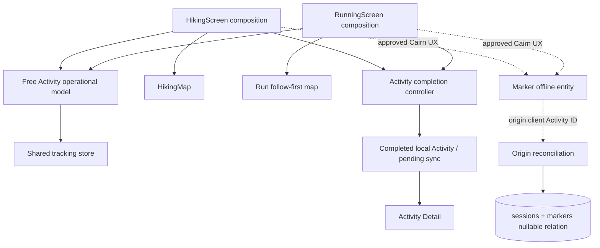

# Free Activity architecture assessment

## Classification

**ARCHITECTURE CHANGE RECOMMENDED** for the Free Activity presentation/completion boundary.
**ARCHITECTURE CHANGE REQUIRED** before durable Cairn ↔ Activity provenance can be claimed.

The existing shared recorder is healthy enough to support the proposed product. A new monolithic `ActivityScreen` is neither required nor recommended.

## Current health

### Healthy shared foundation

- `useTrackingStore` owns one live Activity lifecycle and all recorded values for both modes.
- `deriveActivityOperationalState` turns tracking status, finish locking, recovery, completion, and error inputs into mutually exclusive UI states.
- Start and Finish are guarded at the store boundary, not only by buttons.
- The crash-safe writer stores `activity_mode` and supports both Hike and Run recovery.
- Background/foreground location switching, timing, GPS filtering, dynamic sampling, server session, pending sync, and Memory flush are shared.
- `useSessionStore` owns completed local Activities and local trace cache.

### Drift-prone structure

- `HikingScreen.tsx` is roughly 2,095 lines; `RunningScreen.tsx` roughly 1,964; `HikingMap.tsx` roughly 738; `MapHistoryScreen.tsx` roughly 2,308.
- Stats strips, GPS presentation, action trays, map readiness, finish UI, and navigation results are duplicated.
- Hike uses extracted `HikingMap`; Run mounts two inline Mapbox configurations.
- Hike and Run have materially different completion state machines.
- Running uses the shared P0 save-loss hook; Hiking retains two screen-local AppState/Alert effects implementing the older contract.
- Hike recovery discovery includes disk, remote-shell fallback, stale-file checks, and local-session dedupe; Run uses the smaller shared disk recovery helper.
- Hike honors the hidden map-layer setting; Run hardcodes outdoors.
- Hike ready GPS and Run ready GPS use different local flags and can present misleading colors/copy.
- Activity Detail uses local session identity safely for trace fallback, but completion callers do not receive an explicit verified `SaveResult`.

## Candidate shared contracts/components

These can be shared without merging the screens:

1. **`FreeActivityOperationalModel` (pure adapter):** mode, operational state, time, distance, elevation, derived pace, GPS permission/readiness, GPS signal state, map readiness, `canStart`, `canPause`, `canResume`, `canFinish`.
2. **`ActivityStatsStrip`:** three metric slots plus GPS status. Hike supplies elevation; Run supplies pace.
3. **`ActivityActionTray`:** lifecycle labels and callbacks only. Cairn callback stays mode-composed until the product decision is made.
4. **`ActivityMapReadiness`:** common loading/offline/unavailable vocabulary and state contract; actual maps remain separate.
5. **`ActivityRecoveryHost`:** unfinished and save-loss surfaces with one mode-aware copy contract. Recovery discovery may retain platform-specific sources behind a shared service.
6. **`ActivityCompletionController`:** freeze, too-short result, name, exactly-once stop, verified local Activity lookup, `{ localId, remoteId?, syncState }`, and destination. It must not own the visual summary.
7. **`ActivityCompletionDestination`:** one helper for the Home → Trails Activities → Activity Detail stack.

## What remains Hike-specific

- `HikingMap` interactive gesture release/follow/recenter behavior.
- Elevation-first presentation.
- Hike-only overspeed policy and its banner.
- Any approved full/simplified Hike Cairn composition.
- Hike-specific supportive copy/artwork that follows the visual authority.

## What remains Run-specific

- Follow-first, low-attention active map composition.
- Pace-first presentation.
- Any approved temporary Explore policy.
- Any approved quick-Cairn interaction.
- Run-specific supportive copy/artwork.
- A Run Complete surface only if the product owner deliberately keeps it after choosing the completion destination.

# Architecture Change Proposal

## Current problem

The data/lifecycle core is shared, but each screen independently interprets and presents that core. The most consequential result is not visual duplication: Run continues recording while its finish-name sheet is open, Run can show completion after discarding a too-short recording, Hike and Run use different save-loss hosts, and each invents its own post-save navigation.

Cairn origin is a second, separate gap. The only current association exists in device-local Run state; Full Plant has none; the backend cannot represent it.

## Why the current structure will hurt current function or future extension

- Fixes to finish/recovery/GPS truth must be repeated and can diverge again.
- Route context would otherwise be threaded independently through two screens, recreating the current cosmetic-only Route selection problem.
- A post-save Activity Detail contract cannot reliably distinguish a locally saved pending Activity from a hard local-save loss without a return value.
- Post-Activity Cairn enrichment cannot rely on mutable Marker IDs, spatial proximity, or a device-only session field.

## Proposed boundary

## Files/components affected by a future implementation

Expected existing files:

- `app/src/screens/HikingScreen.tsx`
- `app/src/screens/RunningScreen.tsx`
- `app/src/screens/HikingMap.tsx`
- `app/src/screens/StopSummarySheet.tsx`
- `app/src/screens/MapHistoryScreen.tsx`
- `app/src/features/activity/activityOperationalState.ts`
- `app/src/features/activity/activityRecovery.ts`
- `app/src/features/activity/useActivitySaveLossRecovery.ts`
- `app/src/store/useTrackingStore.ts`
- `app/src/store/useSessionStore.ts`
- `app/src/screens/PlantScreen.tsx` and/or a new approved Activity Cairn surface
- `app/src/store/useMarkerStore.ts`
- `app/src/services/markerOfflineEntities.ts`
- `backend/src/routes/sessions.js`
- `backend/src/routes/markers.js`
- additive backend migration(s)

Likely new small files, names illustrative rather than mandated:

- `app/src/features/activity/useFreeActivityOperationalModel.ts`
- `app/src/features/activity/ActivityStatsStrip.tsx`
- `app/src/features/activity/ActivityActionTray.tsx`
- `app/src/features/activity/activityCompletion.ts`

## Migration approach

1. Add characterization tests for both current screen contracts, especially valid Finish, too-short Continue/Discard, hard save loss, and pending Activity Detail.
2. Extend the pure operational adapter; do not move tracking state into another store.
3. Extract stat/action presentation behind mode-provided slots/callbacks while preserving each screen and map.
4. Introduce one completion controller and explicit save result; migrate Hike and Run separately behind tests.
5. Normalize recovery hosting and mode-aware copy.
6. Only after the Cairn product choice is approved, add client Activity identity to the API/schema and nullable origin relation with dual-read/backward-compatible payloads.
7. Reconcile Marker-first and Activity-first upload order idempotently; test local Marker ID replacement.
8. Remove now-unreferenced legacy members only after imports, runtime reachability, recovery, offline, hidden settings, and native tests are rechecked.

## Regression risks

- Starting twice or allowing Start to reappear during Paused/Finishing.
- Stopping twice, saving twice, or navigating before local Activity persistence.
- AppState races that create duplicate foreground/background location sources.
- Losing the crash-writer rename or resurrecting a just-completed recording as unfinished.
- Breaking Hike interactive follow/recenter or Run’s follow-first behavior.
- Misreporting GPS versus map readiness.
- Pending-sync Activity Detail loading an empty remote shell instead of local points.
- Marker upload acknowledgement changing IDs without updating Activity associations.
- Full Plant navigation obscuring an active recording.
- Accidentally wiring `followingRouteId` or dormant guidance during a Free Activity pass.

## Dead code removable only after migration

- Hike’s screen-local save-loss Alert/AppState block after both modes use the shared host.
- Run’s standalone completion state/page if the product decision selects Activity Detail only.
- Hike’s unused `onConfirmAndHome` callback and the matching unused StopSummary prop.
- Duplicated stat/action styles after both screens consume shared presentational primitives.
- No Route-following or future navigation code becomes removable from this work.
