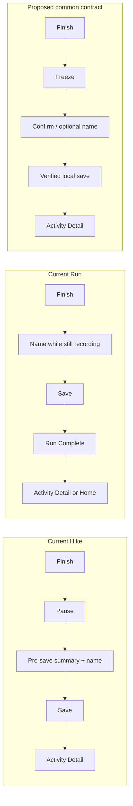

# Current versus target Free Activity

Feasibility: **A** directly supported; **B** small change; **C** architecture change; **D** product-model conflict; **E** product decision required.

| State | Current Hike | Current Run | Proposed product direction | Feasibility | Important gap |
|---|---|---|---|---:|---|
| READY | Map, Free Hike/no Route, four zero stats, GPS item, Start; foreground fix and Routes prime on entry | Map, Free Run/no Route, Route None, four zero stats, Start, auto-lock copy; GPS/map state presentation is internally inconsistent | Map-led identity, truthful GPS/map readiness, one Start, zero metrics de-emphasized | **B** | GPS readiness state exists but current labels/colors do not always reflect it; Run hardcodes outdoors map layer |
| STARTING | Shared recorder reserves local ID and enters `requesting`; Start disables | Same recorder and state | One idempotent Start with visible progress/failure | **A** | Minor presentation convergence only |
| TRACKING | Shared trace/time/distance/elevation; interactive map; tray auto-opens then collapses; Hike-only overspeed and lap feedback | Shared trace/time/distance/elevation; pace derived; fully locked follow map; similar tray | Shared lifecycle/stat/action contract with mode-specific primary metric and map composition | **B** | Duplicated shell and GPS/map readiness; Run does not show elevation though it records it |
| PAUSED | Pause stops timer/location sources; control becomes Resume; Finish stays present | Same shared store behavior and control labels | Resume + Finish; never show Start | **A** | Presentation is duplicated, but P0 derived state prevents contradictory Start |
| FINISH | Valid Finish pauses immediately and opens a rich summary/name sheet | Valid Finish opens name sheet without pausing; metrics may continue changing | Freeze once, confirm/name once, save once | **B** | Run must pause/freeze before confirmation; Hike labels pre-save sheet “Complete” |
| SAVE | Hike sheet shows save progress; captures local ID; 30s UI wall; local pending fallback; then opens detail | Name Save calls shared stop; then opens separate Run Complete surface | Return a verified local Activity result, expose pending sync honestly, avoid blank-detail navigation | **B** | Screens do not consume an explicit save result; hard local-save failure can leave captured ID without a detail object |
| COMPLETED | Directly lands on Activity Detail after View Activity | Lands on Run Complete; user chooses View Activity or Done | Prefer one Activity Detail destination, subject to product approval | **E**, technically **B** | Current mode-specific destinations; Activity Detail lacks Run pace and explicit pending status |
| RECOVERY | Home unfinished card; Hike discovery includes disk checks and remote unfinished-shell fallback; shared recovery modal; screen-local save-loss Alerts | Home card; local writer discovery; same restore/discard modal; shared P0 save-loss host | Same recovery contract and copy for both modes | **B** | Discovery and save-loss hosts still diverge; Hike implementation is much larger |
| CAIRN | Opens Full Plant; tracking continues; success opens Marker Detail; Back returns to active Hike; no durable Activity relation | Quick local-first personal Cairn with empty note at current coordinate; local session link only | Approved Cairn option, explicit return, reliable optional Activity provenance, monotonic Memory | **E** for UX; **C** for provenance | Backend Marker lacks Activity FK/client origin; both paths unlock Memory through shared marker creation despite stale Plant comments |

## Current versus target completion sequence

## Shared core versus mode composition

| Shared contract | Hike-specific | Run-specific |
|---|---|---|
| Operational state and guards | Interactive `HikingMap` | Follow-first non-interactive active map |
| GPS/location authority | Elevation as primary metric | Pace as primary metric |
| Trace, time, distance, elevation collection | Hike overspeed warning | Run low-attention presentation |
| Background/foreground source switching | Approved Hike Cairn composition | Approved Run Cairn composition |
| Pause/resume/finish semantics | Optional Hike-specific context copy | Optional Run Complete only if product owner deliberately retains it |
| Crash writer and recovery | Recenter behavior | Any future Explore behavior remains unapproved |
| Save fallback and local Activity identity |  |  |
| Detail destination contract |  |  |

## Product-language target

Free Hike and Free Run should feel like two purposeful ways to record the same kind of object. Hike gives the map and elevation more importance because people may stop and explore. Run puts pace and an automatically following map first because attention is scarce. Both start, pause, resume, finish, recover, save, and open the resulting Activity in the same dependable way.
