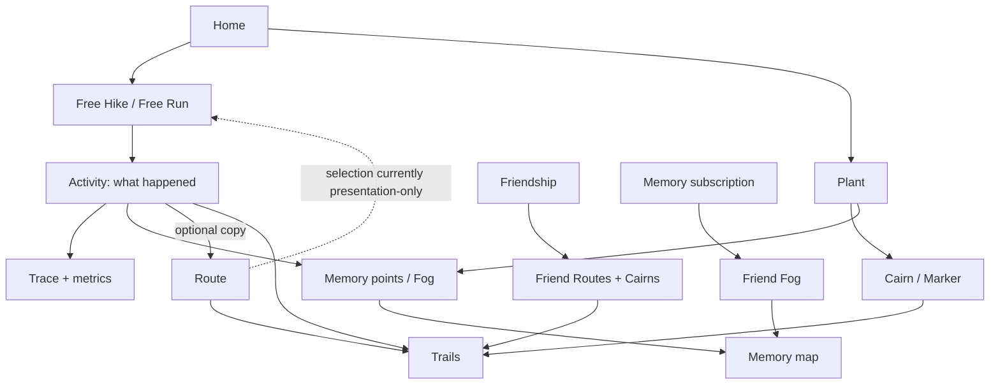

# CairnNZ global domain model

Audit date: 2026-09-05
Repository: `/Users/mzm/Desktop/cairn/CairnNZ`
Code authority: current working tree on `master`, committed `HEAD` `a9157af0e20c19cb19c55ff2bc52a5846bf2fe8c`
Production comparison: OTA commit `6d4a682dfa479acded07d41daaedcc1607f82f1f`; backend runtime inspected read-only

## Evidence vocabulary

- **FACT** — directly proven by current active local code, schema, tests, or controlled runtime. A scope qualifier says when the fact is local-HEAD-only.
- **HUMAN INTENT** — explicitly stated in the audit brief, regardless of current implementation.
- **INFERENCE** — strong interpretation that is not encoded as a contract.
- **LOCAL CANDIDATE** — present only in an uncommitted working-tree change.
- **PRODUCTION FACT** — checked against the deployed OTA, container, health endpoint, or read-only production schema.
- **DORMANT / FUTURE** — code exists but is not in an ordinary current flow.
- **DEV / QA ONLY** — development or test infrastructure.
- **LEGACY / UNUSED — CONFIRMED** — no meaningful caller or production entry point remains.
- **UNKNOWN** — evidence is insufficient.

## The current product in one model

**FACT:** CairnNZ is an outdoor recording and exploration product. Home starts a free Hike, free Run, or the standalone Plant flow. A Hike or Run records one factual Activity. Completion stores a trace and metrics and contributes simplified points to Memory/Fog. The Activity can optionally be copied into a separately owned, editable Route. Trails hosts the personal Activity history, personal/friend Route library, and personal/friend Cairn library. Friends changes access to friend-tier Routes and Cairns. Memory adds a separately subscribed union of friends' exploration points.

**HUMAN INTENT:** Route selection must eventually lead to another Hike/Run Activity that retains the planned Route relationship.
**FACT:** The implemented loop is incomplete: Route selection does not enter the tracking store or saved session payload, and Route Detail cannot start an Activity. The dotted edge in the diagram is therefore presentation-only today.

## Canonical terms

| Term | Current meaning | Current status |
|---|---|---|
| User | Backend account row plus client auth/session identity. Owns sessions, routes, markers, memory points, friendships, subscriptions, and preferences. | **FACT — ACTIVE** |
| Friend | Another user with a mutual relationship represented by two directional `friends` rows after request acceptance. | **FACT — ACTIVE** |
| Activity | A completed or in-progress factual GPS recording. Client type is `TrackingSession`; backend noun/table is `session`/`sessions`. | **FACT — ACTIVE** |
| Hike / Run | Values of Activity mode/type (`hiking` or `running`) and separate UI hosts over the same tracking domain. They are not separate persisted objects. | **FACT — ACTIVE** |
| Route | A reusable, user-owned planned path with independently editable geometry and visibility. It is not an Activity. | **FACT — ACTIVE, reuse PARTIAL** |
| Cairn | The primary UI noun for a location annotation. | **FACT — ACTIVE** |
| Mark / Marker | The frontend/backend technical noun for the same persisted object shown as a Cairn. It is not a second object or subtype. | **FACT — ACTIVE** |
| Plant | A creation verb and three-step Cairn workflow, not a stored domain object. | **FACT — ACTIVE** |
| Memory | The active exploration-map experience and its client state. There is no `memory` object/table representing an Activity story. | **FACT — ACTIVE, composite** |
| Fog / exploration | A rendered unexplored-space mask derived from personal and subscribed-friend `memory_points`; H3 cells are a derived cache, not the server source. | **FACT — ACTIVE, provenance PARTIAL** |
| Trails | One stack screen combining Activity history, Route library, and Cairn management/discovery within Mine/Friends scopes. | **FACT — ACTIVE** |

## Domain inventory and authority

| Domain | Frontend model and owner | Backend / DB authority | APIs | Owning surfaces | State/lifecycle classification |
|---|---|---|---|---|---|
| User / account | `useAppStore`; JWT in SecureStore; local onboarding/account modals | `users`, OAuth identities, reset codes, token blacklist | `/api/auth/*`, `/api/profile/*` | Auth, onboarding, Settings | **FACT — server-authoritative hybrid, ACTIVE** |
| Friend request | `useFriendStore` API-derived lists | `friend_requests` | `/api/friends/requests*` | Friends | **FACT — ACTIVE** |
| Friendship | `useFriendStore` cache | Two symmetric `friends` rows; blocks separate | `/api/friends`, `/api/friends/:id`, block endpoints | Friends; affects Trails and circle content | **FACT — server-authoritative, ACTIVE** |
| Activity | `TrackingSession`; `useTrackingStore` live; `useSessionStore` completed; JSONL/filesystem and pending payloads | `sessions`, `session_point_ops`; `memory_points` written in atomic save | `/api/sessions/*` | Hiking, Running, Trails Activities, MapHistory | **FACT — hybrid, ACTIVE** |
| Route | `Route`; `useRouteStore`; transient `useRouteEditStore` and local route extras | `routes`, `route_edit_envelopes`; server is library authority | `/api/routes*`, `/api/circle/routes` | Trails Routes, MapHistory Route Detail, RouteEditor, Hike/Run picker | **FACT — ACTIVE, Activity reuse PARTIAL** |
| Cairn / Marker | `Marker`; `useMarkerStore`; offline marker entity queue | `markers`, `marker_votes`, `hidden_items` | `/api/markers*`, `/api/circle/markers`, `/api/public/markers`, vote/hide/report | Plant, Hiking, Running, Trails Cairns, MarkerDetail, Memory pins | **FACT — hybrid, ACTIVE** |
| Memory point | `VisitedPoint`; `useMemoryStore`; local persistence/sync | `memory_points`, `unlocked_regions` | `/api/memory*`, `/api/circle/fog` | Memory, Home/Settings statistics | **FACT — hybrid, ACTIVE** |
| Fog | Derived Turf geometry plus derived H3 cell cache; friend cache grouped by friend before flattening | No Fog table; source is `memory_points` and `memory_subscriptions` | `/api/circle/fog` | Memory | **FACT — derived, ACTIVE; revocation defect** |
| Privacy | Object-specific fields and editors; no global default | `routes.permission`, `markers.permission`; Activities have no field | Route/marker CRUD and circle/public reads | RouteEditor, Plant, Trails filters/details | **FACT — asymmetric, PARTIAL** |
| Subscription | `useEntitlementStore`, `iapService`, `PaywallSheet` | `users.account_type`, `memory_subscription_limit`; no verified provider webhook | RevenueCat SDK; `/api/memory-subscriptions` | Memory friend picker/paywall | **FACT — PARTIAL** |
| Settings | `useSettingsStore`, `useMemorySettingsStore`, local component state | limited server `prefs`/push prefs; most settings local only | profile/export/delete/push prefs | Settings, hidden Debug | **FACT — mixed; active/dormant/dead entries** |
| Notifications | `pushService` and settings code exist | `device_tokens`, `notification_log`, push cron | `/api/push/*` | hidden settings code only | **DORMANT / FUTURE** |

## Global state ownership and reconciliation

| Domain | Authoritative owner | Secondary copies/caches | Reconciliation boundary and risk |
|---|---|---|---|
| Activity, live | `useTrackingStore` plus foreground/background location sources and active JSONL | screen-derived operational state; incremental server shell | **FACT:** store owns lifecycle. Filesystem recovers process loss. P0 makes screen state derived rather than competing. |
| Activity, completed | Server `sessions` for remote rows; `useSessionStore` and per-session local track-point keys for device history | pending-sync/save-loss payload | **FACT:** hybrid merge dedupes `id`/`remoteId`. Local rename never reaches server. Local delete is immediate and remote delete is fire-and-forget. |
| Route | Server `routes` | Zustand list, transient editor draft, local original/segment extras | **FACT:** no durable offline route library. API helpers return `null`/`false`, while store update/delete can treat that as success, creating local/server divergence. |
| Cairn | Server after acknowledgement; offline entity queue before acknowledgement | Zustand own/circle/public slices; local-only voice/session metadata | **FACT:** create has durable retry. Update/delete are optimistic and swallow remote failure; friend/public caches are not invalidated consistently. |
| Memory | Server `memory_points` plus local unsynced points | local point persistence, derived H3 set | **FACT:** point merge uses client IDs. No source/activity provenance means deletion and recomputation cannot be source-aware. |
| Fog | Derived from current personal points plus selected subscribed-friend cache | Turf mask and H3 cache | **FACT:** same geometry visually unions, but server points do not identify Activity source; friend provenance is only the cache key before flattening. |
| Friends | Backend relationships/requests/blocks | `useFriendStore` API cache | **FACT:** optimistic mutation rollback exists in Friends, but Route/Cairn/Fog caches are not transactionally invalidated. |
| Settings | Local Zustand + AsyncStorage | screen-local form state; limited server push/profile fields | **FACT:** several persisted settings have no visible control or only dormant consumers. |
| Auth/session | Backend user/token version/blacklist; JWT locally in SecureStore | `useAppStore` user and logout marker | **FACT:** client hydration refreshes near expiry and live tracking schedules refresh; local logout clears active slices but is not a domain-data deletion. |
| Entitlement | RevenueCat SDK/cache for purchase state; server independently enforces numeric Memory cap | `useEntitlementStore` | **FACT:** provider entitlement and server limit have no implemented reconciliation, so paid success does not prove a larger server cap. |

## Relationship answers

| Question | Answer and evidence classification |
|---|---|
| Can Activity exist without Route? | **FACT — YES.** Free Hike and Free Run are normal entry paths; current Activity save omits `route_id`. |
| Can Route exist without Activity? | **FACT — YES at the data/API level.** `routes` has no source-session field and POST accepts geometry. **FACT:** ordinary current UI creation is only Activity → Route. |
| Does Activity reference Route? | **FACT — schema can:** `sessions.route_id` exists. **FACT — active client does not:** start/save payloads never send it. **PRODUCTION FACT:** the intended FK is absent in production. |
| Can one Route be used by many Activities? | **HUMAN INTENT — YES.** **FACT — not represented by active saves.** Selection can be repeated, but resulting Activities retain no Route identity. |
| Can one Activity generate a Route? | **FACT — YES.** Activity Detail opens RouteEditor from its trace. |
| Can one Activity generate multiple Routes? | **FACT — YES in current behavior.** The action is repeatable and there is no uniqueness constraint or source link. Whether this is intended is **UNKNOWN**. |
| Can Route be edited independently? | **FACT — YES.** RouteEditor updates route geometry/name/permission without changing the source Activity. |
| Does Cairn reference Activity? | **FACT — only locally and only when Running's quick Cairn calls `linkMarker`.** The backend marker has no `activity_id`. Full Plant from Hiking does not link it. |
| Does Cairn reference Route? | **FACT — NO.** No client field, API field, or DB column. |
| Can Cairn exist independently? | **FACT — YES.** Standalone Plant is a primary Home action. |
| Does Memory reference Activity? | **FACT — NO persistent reference.** Completion copies simplified points into `memory_points` without `session_id`. |
| Does Memory copy Activity data? | **FACT — YES, selectively.** `flushHikingToMemory` simplifies the recorded trace into point samples; atomic session save writes those points. |
| Does Fog derive from Activity trace? | **FACT — YES, among other sources.** Activity completion contributes Memory points; Plant currently also inserts one point. |
| Does friend-shared Fog preserve provenance? | **FACT — PARTIAL.** Client fetch/cache keeps a friend grouping, but rendered points are flattened; DB rows identify the owner friend, not the originating Activity. |
| Can an explored unit have multiple sources? | **FACT — geometrically YES.** Personal points and multiple friends can overlap. **FACT:** personal points cannot express multiple Activity provenance. |
| How are sources reconciled? | **FACT:** rendered buffers/cells union spatially. There is no source-count/ref-count reconciliation table. |
| What happens when one source disappears? | **FACT:** removing one friend subscription excludes that friend's cache on refresh and other overlapping owners remain. **FACT:** deleting an Activity or Cairn does not remove its Memory contribution, because provenance is absent. **FACT:** removing/blocking a friend does not remove the Memory subscription, so that source does not currently disappear. |

## Object ownership and lifecycle matrix

| Object | Who creates it | What owns it / references it | Modify | Delete | Deletion effects / survivors | Server vs local |
|---|---|---|---|---|---|---|
| Activity | Hike/Run tracking store creates local identity and server shell | User; local history; optional local marker IDs. No active Route backlink. | Local rename only; trace is not edited | Activity Detail/legacy history | Removes local summary/points and requests server delete. Routes, Cairns, Memory, Fog survive. No rollback if server delete fails. | **FACT — hybrid** |
| Route | RouteEditor from an Activity trace; API could accept any geometry | User; Trails. Activities do not actively reference it. | RouteEditor / detail rename | Route Detail / editor | Route and edit envelope removed server-side; Activities/Memory/Cairns unaffected. Local false-success risk. | **FACT — server authoritative** |
| Cairn / Marker | Full Plant or Running quick Cairn | User; Trails/Memory rendering; optional local Activity marker ID | MarkerDetail for own markers | MarkerDetail and Hiking sheet | Marker/votes removed server-side. Memory point/Fog and local Activity marker IDs survive. Local false-success risk. | **FACT — hybrid** |
| Memory point | Activity completion and, currently, every Plant create; sync pull/push | User; Fog and exploration metrics | No point editor | Memory reset or account hard delete; no per-source deletion | Fog/H3 recompute from remaining points. `unlocked_regions` may survive account hard delete in production because no FK. | **FACT — hybrid** |
| Fog | Derived when Memory renders | Current point sets and scope selection | Recomputed from points | No direct delete; reset Memory deletes points | Personal and other-friend overlap survives a correctly removed source. Current friendship removal fails to remove subscription source. | **FACT — derived** |

## Activity lifecycle

```mermaid
stateDiagram-v2
  [*] --> Ready
  Ready --> Starting: Start Hike / Run
  Starting --> Tracking: real location source established
  Starting --> Error: permission/source/init failure
  Tracking --> Paused: Pause
  Paused --> Tracking: Resume + source restart
  Tracking --> Finishing: Finish
  Paused --> Finishing: Finish
  Finishing --> Tracking: too short; keep recording
  Finishing --> Saved: atomic remote save or durable local fallback
  Saved --> Viewed: Trails / Activity Detail
  Viewed --> RouteDraft: Save as Route
  RouteDraft --> Route: editor save
  Tracking --> Recovery: process death / active JSONL
  Recovery --> Paused: restore
  Recovery --> Discarded: discard
  Saved --> Deleted: delete Activity
```

1. **CREATE / START — FACT:** Hike or Run calls the shared `startTracking(mode)`. Local committed P0 synchronously moves `idle → requesting`, refuses a duplicate call, proves foreground/background location before claiming Tracking, creates an append-only JSONL record, starts runtime monitors, and asynchronously starts a server session shell.
2. **TRACK — FACT:** foreground watcher and background task feed GPS fixes into shared filtering/deduplication, distance/elevation/duration, raw/smoothed arrays, JSONL, and batched remote append backup.
3. **PAUSE / RESUME — FACT:** pausing stops location. Resume restarts a real source; cold recovery also rebuilds app-state switching, backup, monitors, auto-pause, and token refresh.
4. **FINISH — FACT:** a shared in-flight lock refuses duplicate finish. Fewer than two points or less than 20 metres invokes a keep/discard decision rather than saving.
5. **SAVE — FACT:** completion map-matches with a Kalman/smoothing fallback; the displayed/saved route is the processed trace while raw audit points are retained separately. Both modes call `flushHikingToMemory`, then one backend transaction finalizes the session and inserts Memory points.
6. **OFFLINE FALLBACK — FACT:** final-save failure writes a user-scoped pending payload for the sync daemon. Failure to preserve even that invokes the durable SAF-01 Retry/Discard recovery payload. The local Activity summary is still added.
7. **RECOVER — FACT | LOCAL HEAD ONLY:** mode-aware unfinished JSONL recovery exists for both Hike and Run. This Running parity and the P0 operational guards are committed locally but absent from the production OTA.
8. **VIEW — FACT:** Trails Activities reads `useSessionStore`; MapHistory hydrates detailed points from server or per-session local storage.
9. **GENERATE ROUTE — FACT:** any detail with at least two loaded points can open RouteEditor and POST a new Route.
10. **DELETE / DISCARD — FACT:** discarding an unfinished recording deletes the active file/shell. Deleting a saved Activity removes local history immediately and requests server deletion; it does not reverse Memory/Fog or delete linked objects.

## Hike and Run

**FACT:** Hike and Run are separate screens over one Activity object and one tracking engine, distinguished by `ActivityMode`/server `sessions.type`.

| Classification | Current evidence |
|---|---|
| Shared core | `useTrackingStore`, `useSessionStore`, GPS/background task, pause/resume, completion/save, Memory flush, pending sync, recovery payloads. |
| Intentional domain difference | Mode label, pace/speed presentation, Hike/Run-specific composition. |
| Accidental divergence | Hike launches full Plant; Run creates a one-tap private blank Cairn. Hike visualizes only a selected Route start pin; Run does not use selected geometry. Full Plant does not link to Activity; quick Cairn does locally. |
| Local P0 convergence | **FACT | LOCAL HEAD ONLY:** exclusive derived operational state, duplicate Start/Finish guards, mode-filtered recovery, Running recovery parity, keep-awake removal, and Running map readiness. |

## Route lifecycle and Activity generation

**FACT:** The active UI has no manual blank Route creation, file import, duplication, or public creation. A new Route starts at Activity Detail's **Save as Route** action.

1. Activity must expose at least two loaded trace points.
2. MapHistory navigates to `RouteEditor({ fromSessionId })`.
3. RouteEditor loads the local/per-session trace and smooths it; optional active editing/map matching changes the proposed geometry.
4. Name is required and has no Activity-derived default. Distance/elevation are recomputed. Visibility is selected as personal or friend.
5. `POST /api/routes` creates a Route owned by the current user.
6. The Route appears in Trails → Routes → Mine and can be edited/deleted independently.

**FACT:** No `source_activity_id`, source mode, generated-at relation, or uniqueness constraint is written. The Activity is not updated with the Route ID. This is the exact Activity → Route provenance break.

**FACT:** Route → Activity reuse breaks earlier. Hike and Run can select a Route before Start, but selection stays in screen-local state. It is not passed to `startTracking`, not stored as `followingRouteId`, not saved as `sessions.route_id`, and does not increment `run_count`. Hike shows only the Route's first point after start; Run ignores selected geometry. Route Detail has no Hike/Run action. Free mode is clean because `selectedRoute = null` is the normal default.

## Cairn, Mark, Marker, and Plant lifecycle

**FACT:** Cairn is the current product noun; Marker/Mark is the persisted/client technical noun; Plant is a verb/workflow. All creation paths produce the same marker API/table object.

Meaningful marker properties proven in code/schema are: owner, latitude/longitude/altitude, timestamps, type (`danger`, `junction`, `water`, `hut`, `cairn`), encoded title/body text, permission, approximate/GPS metadata, public snapshot, helpful/report votes, moderation status, and local sync metadata. There is no media upload in the active flow, no backend voice URI, no `activity_id`, no `route_id`, and no direct Memory foreign key.

### Full Plant

1. **ENTRY — FACT:** Home standalone action, Trails Cairns empty-state CTA, and Hiking's Plant action. Marker/Map detail does not create a new Cairn.
2. **LOCATION — FACT:** five-second GPS sampling plus a map pin that can be nudged within 50 metres; approximate/accuracy metadata is retained.
3. **CONTENT — FACT:** three-step location/content/confirmation flow; category plus required title/body. Default category is danger.
4. **PRIVACY — FACT:** default is personal/private. Friend is selectable. Public UI is disabled and backend client writes reject public.
5. **SAVE — FACT:** one offline-first marker entity is written locally before network drain. Network/5xx remains pending; hard 4xx becomes failed/retryable; local storage failure preserves the draft and reports failure.
6. **RESULT — FACT:** success lands on MarkerDetail. Own Cairns appear in Trails and Memory.
7. **MEMORY SIDE EFFECT — FACT:** `useMarkerStore.addMarker` inserts a local Memory point at the Cairn coordinate. This contradicts Plant comments and some deletion copy.
8. **EDIT / DELETE — FACT:** MarkerDetail edits/deletes own markers. These operations are optimistic without a durable rollback queue and do not remove the Memory point.

### Running versus Hiking creation

| Path | Current result |
|---|---|
| Hiking | **FACT:** opens full Plant. It does not pass or persist an Activity association. |
| Running | **FACT:** one-tap quick Cairn at current location; type `cairn`, personal permission, blank note. Calls local `linkMarker`, so the current Activity can display its ID on this device only. |
| Standalone | **FACT:** the same full Plant flow as Hiking, independent of Activity. |

**HUMAN INTENT:** “Running = quick” and “Hiking = full” are not locked product decisions.
**UNKNOWN:** which behavior should become canonical. Code proves only the current divergence.

## Memory and Fog

**FACT:** Memory is a combination of exploration visualization, personal Cairn discovery, Mystery Cairn reveal, and selected friends' exploration. It is not an Activity narrative or saved story.

- Inputs: personal `memory_points`; friend `memory_points` for selected subscriptions; own markers; nearby public marker silhouettes; current location for centering; region attribution.
- Activity relation: both modes simplify completed traces into Memory points. No session relationship survives.
- Plant relation: current marker create adds a Memory point.
- Persistence: local point cache plus server pull/push; derived H3 resolution-11 cells; server `unlocked_regions` attribution.
- Rendering: active Fog uses Turf buffers/differences around point collections. H3 is a derived cache/feature kill switch rather than the rendered server representation.
- Friend picker: separate `memory_subscriptions`, nominal cap five; sixth selection opens PaywallSheet.
- Mystery Cairns: reveal state derives from proximity to personal/friend explored space; owner is always revealed.
- Home percentage: counts points using a fixed conversion against hard-coded regional areas. It is not a unique-H3 or measured explored-area calculation.

### Overlap and revocation

**FACT:** Personal + friend + multiple-friend exploration is visually combined by geometric union; overlapping shapes do not need a single winner. Friend cache keys preserve friend ownership until the selected collections are flattened for render. There is no per-cell source table or reference count.

**FACT:** Unsubscribing from one friend removes that friend's point collection after refresh while personal and other-friend overlaps remain.
**FACT:** Removing or blocking a friend does not unsubscribe them today.
**PRODUCTION FACT:** the deployed database has no `trg_memory_subscription_cap`, while POST relies on that trigger for both mutual-friend authorization and the cap. `/circle/fog` trusts subscription rows and does not re-check friendship. Deployed Fog access can therefore outlive friendship and can be created without the intended authorization check.

## Friendship product-wide consequences

| Human-intended consequence | Current result |
|---|---|
| Remove friendship | **FACT — IMPLEMENTED:** mutual friend rows are removed. |
| Remove friend-only Routes | **FACT — PARTIAL:** server circle query stops returning them, but client `circleRoutes` is not cleared transactionally and can remain stale until reload. |
| Remove friend-only Cairns | **FACT — PARTIAL:** same server behavior and stale-cache boundary as Routes. |
| Remove Fog available only through that friend | **FACT — CONTRADICTED:** the Memory subscription remains, and `/circle/fog` trusts it. |
| Preserve own Fog and independently supported overlaps | **FACT — structurally supported:** sources are grouped by owner for fetch/cache and spatially unioned. Activity-level personal provenance is absent, so only owner-level preservation is expressible. |

Friendship grants server-authorized reads of friend-tier Routes and Cairns and changes Friends/profile statistics. It does not grant access to Activities. Memory/Fog uses an additional subscription relation. Blocking removes friendship and rejects pending requests but does not clean subscriptions; nearby public-marker reads also do not filter blocks.

## Account and data lifecycle

**FACT:** Email registration requires verification and date of birth; login, Apple sign-in, forgot/reset password, JWT refresh, profile name/password changes, export, logout, soft deletion, and restore are implemented. Google UI currently reports that a configured build is required although backend support exists.

**FACT:** Account deletion sets `users.deleted_at`, revokes the current token, unregisters device tokens, sends a non-blocking email, permits restore, and is later hard-deleted by cron. Hard deletion relies on FK cascades for sessions, routes, markers, memory points, friendships/subscriptions, votes, and related account data.

**PRODUCTION FACT:** the deployed grace period and sweep are the explicitly marked test configuration: five minutes and a one-minute cron. `unlocked_regions` has no production FK to users and may survive hard deletion as an orphan. This is implementation reality, not a legal/compliance policy statement.

## Offline classification

| Domain | Classification | Current boundary |
|---|---|---|
| Activity tracking | **FULL OFFLINE for recording; PARTIAL for sync** | GPS/background/JSONL/local summary work without API; durable final payload retries. Base maps remain separately network-dependent. |
| Activity save | **PARTIAL** | Server atomic save preferred; pending daemon and SAF-01 protect loss. No semantic conflict merge. |
| Route | **ONLINE REQUIRED for create/edit/delete; PARTIAL transient view** | No durable route library/cache; in-memory list may remain visible. |
| Cairn | **FULL/PARTIAL offline create; PARTIAL view; edit/delete online-gated in detail** | Durable create queue. Update/delete lack comparable durable recovery. |
| Memory / personal Fog | **PARTIAL** | Local points/H3 can render; sync and fresh server state need network. |
| Friend Fog / Friends | **ONLINE REQUIRED for authoritative state** | Some in-memory data can remain stale; no durable circle library. |
| Auth | **ONLINE REQUIRED for login/refresh** | Existing unexpired token can support local app startup paths. |
| Mapbox | **PARTIAL / UNKNOWN vendor cache behavior** | No active app-owned offline-region download service. |
| Notifications | **ONLINE REQUIRED and DORMANT** | No active enqueue/registration flow. |

## Failure and recovery inventory

| Failure | Recovery owner | Classification | Current behavior |
|---|---|---|---|
| Interrupted Activity | shared filesystem recovery plus screen host | **FACT — SHARED at local HEAD** | JSONL is discovered by exact mode; restore returns Paused then rebuilds runtime owners, or user discards. Production OTA lacks Running parity. |
| Final Activity save loss | pending sync daemon, then SAF-01 payload | **FACT — SHARED at local HEAD** | retries on boot/network/foreground; last-resort Retry/Discard survives restart and is user scoped. |
| GPS permission/source loss at Start | tracking store | **FACT — SHARED at local HEAD** | refuses to claim Tracking, cleans created owners/shell, and exposes retryable typed error. |
| GPS loss while active | tracking store/screen feedback | **FACT — SHARED/PARTIAL** | background/foreground source switching and monitoring exist; native outcome requires device validation. |
| Mapbox unavailable | each Activity screen plus Memory map states | **FACT — SCREEN-LOCAL presentation over shared map component families** | Hiking/Running local P0 distinguish unavailable; base recording can remain independent. |
| Offline Activity append/finalize | offline queue and sync daemon | **FACT — SHARED** | idempotent queued operations and durable final payload. No semantic conflict resolution. |
| Failed Cairn create | offline marker entity framework | **FACT — SHARED for full/quick create** | network/5xx remains pending; 4xx becomes failed/retry; storage failure is surfaced. |
| Failed Cairn edit/delete | marker store | **FACT — MISSING durable recovery** | optimistic local mutation can diverge because remote failure is swallowed. |
| Failed Route create | RouteEditor/store | **FACT — SCREEN-LOCAL/PARTIAL** | remains in editor/error path; no durable offline draft-to-server queue contract. |
| Failed Route edit/delete | route store | **FACT — MISSING rollback** | API `null`/`false` can be interpreted as success and local state can diverge. |
| Failed Memory sync | memory sync owner | **FACT — SHARED/PARTIAL** | unsynced client-ID points retry; pull/push merge exists; provenance/conflict semantics are limited. |
| Friends mutation failure | friend store/screen | **FACT — SHARED within Friends** | optimistic changes roll back or reload; Route/Cairn/Fog caches are outside the transaction. |
| Token/auth failure | authenticated fetch, app store | **FACT — SHARED** | refresh near expiry; session-expired path returns to Auth; live Activity has scheduled token refresh support. |
| Backend unavailable | domain-specific | **FACT — DUPLICATED** | Activity and Cairn create have durable paths; Routes/Friends/auth require online; details can show stale local state. |

## Background and scheduled state changes

| Process | Owner / trigger | State affected | Failure and user consequence | Classification |
|---|---|---|---|---|
| Background location | Expo TaskManager while an Activity is active/backgrounded | Activity trace, JSONL, incremental append | points remain locally buffered; OS/device behavior needs native proof | **FACT — ACTIVE** |
| Activity pending sync | app boot, network online, app foreground | pending session finalize/remote ID/local sync state | retry retained without expiry; matching-user guard prevents cross-account upload | **FACT — ACTIVE** |
| Cairn create drain | create, network recovery, foreground | pending marker entity → server marker ID | retryable network/5xx; 4xx remains failed for user retry | **FACT — ACTIVE** |
| Memory sync | store subscription, hydration, foreground lifecycle | unsynced `memory_points`, server echo, local merge | retry/merge; no source-aware conflict model | **FACT — ACTIVE** |
| Token refresh | app hydration/near expiry; every 30 minutes while tracking | JWT/session authority | failed refresh can expire session; recording persistence remains local | **FACT — ACTIVE** |
| Auth sweep | backend every minute in deployed TEST-MODE plus boot catch-up | hard-delete accounts; purge blacklist/reset/request records | production five-minute deletion consequence | **PRODUCTION FACT — ACTIVE, unsafe configuration** |
| Push drain/purge | backend every minute / daily 03:30 UTC | notification log/device tokens | rows drop when transport disabled; no current active product producer | **PRODUCTION FACT — DORMANT product capability** |
| Export worker/purge | backend every two minutes / daily 04:00 UTC | requested account exports/files | failed jobs retain status/error; email/result is user-visible | **PRODUCTION FACT — ACTIVE SECONDARY** |
| Hidden-item orphan cleanup | weekly Sunday 03:00 UTC | obsolete hidden-content rows | maintenance only | **PRODUCTION FACT — ACTIVE MAINTENANCE** |

## Notifications and entitlement

- **DORMANT / FUTURE:** Expo push registration and preference UI code exist, as do `device_tokens`, `notification_log`, and the push drain. Registration/unregistration and friend-request event enqueue calls are disabled/commented, and Settings hides preferences behind a hardcoded false gate. No Activity, Route, Cairn, auth, subscription, or background event currently forms an ordinary push-notification product flow.
- **FACT — PARTIAL:** PaywallSheet is reachable when a user tries to select a sixth Memory friend. RevenueCat purchase/restore and entitlement caching exist. Product IDs/offerings/trials are **UNKNOWN** because they live in the provider dashboard.
- **FACT — CONTRADICTION:** the server independently applies `users.memory_subscription_limit` (nominally five), has no verified RevenueCat reconciliation/webhook, and the production enforcement trigger is missing. A purchase therefore does not establish expanded server capability.

## Product action matrix

| Action | Activity | Route | Cairn | Memory |
|---|---|---|---|---|
| Create | YES | YES, from Activity only | YES | YES, derived points only |
| View | YES | YES, own; friend detail broken | YES, own; friend detail broken | YES |
| Edit | PARTIAL, local rename only | YES | YES, own | NO point editor |
| Delete | YES, non-transactional local/remote | YES, false-success risk | YES, false-success risk | YES, reset-all only |
| Change privacy | NO | YES: private/friends | YES: private/friends | NO |
| Share | NO | PARTIAL through friend visibility | PARTIAL through friend visibility | PARTIAL through friend subscription |
| Duplicate | NO | NO | NO | NO |
| Generate Route from | YES | NO | NO | NO |
| Start Activity from | NO | PARTIAL picker-only, no retained relationship | NO | NO |
| Navigate with | NO | DORMANT | NO | NO |
| Recover | YES | NO draft recovery contract | PARTIAL create retry | PARTIAL sync retry |
| Offline create | YES | NO | YES | YES through contributing flows |
| Offline view | YES locally | PARTIAL in-memory | PARTIAL locally | PARTIAL locally |

## Current product boundary

- **CORE ACTIVE:** Home; auth/session; free Hike/Run recording; Activity persistence/recovery/history/detail; Plant/Cairn create; personal Memory/Fog; Trails libraries.
- **ACTIVE SECONDARY:** Friends/requests/blocks; friend Routes/Cairns; Memory friend picker; Route generation/editing; account/profile/export/deletion.
- **PARTIAL:** Route → Activity reuse; Cairn ↔ Activity association; friend detail reachability; friend-Fog revocation; subscription entitlement enforcement; Activity rename sync; public objects; offline update/delete.
- **DORMANT / FUTURE:** turn-by-turn Route following, off-route/voice guidance, push notifications, public client publishing, voice Cairns, paid unlimited Memory behavior.
- **DEBUG / DEV:** preview stacks, component labs, web QA bridge, generated screens, simulator; production-shipped hidden Debug is classified separately as hidden/debug, not an ordinary flow.
- **LEGACY:** the unparameterized MapHistory combined index and unused bottom-tab interpretation; dead/removed offline map service and obsolete feature-flag backend.
- **UNCERTAIN:** provider dashboard product identifiers/offerings, external Mapbox cache/license behavior, intended policy for multi-generation Routes and Cairn-derived Fog.
