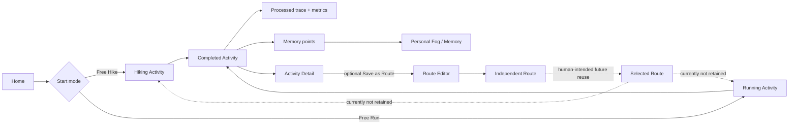
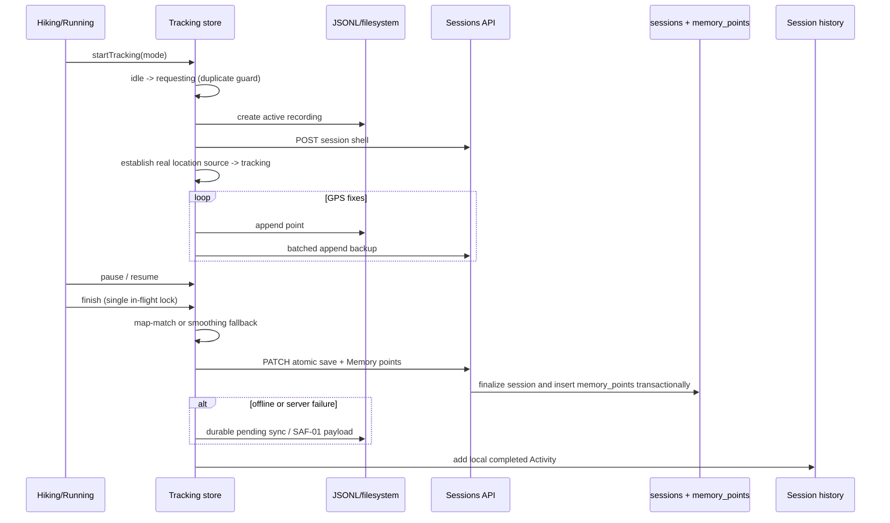
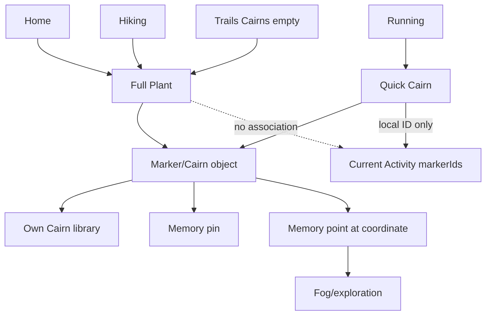
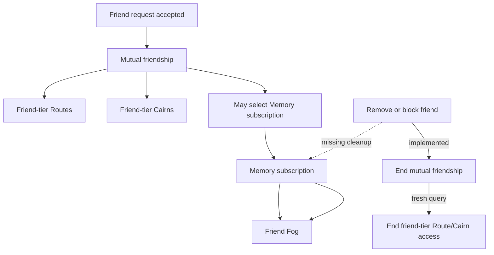
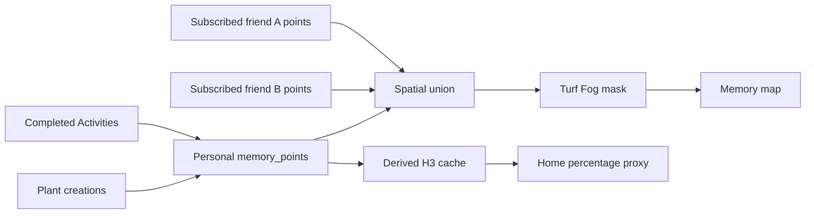
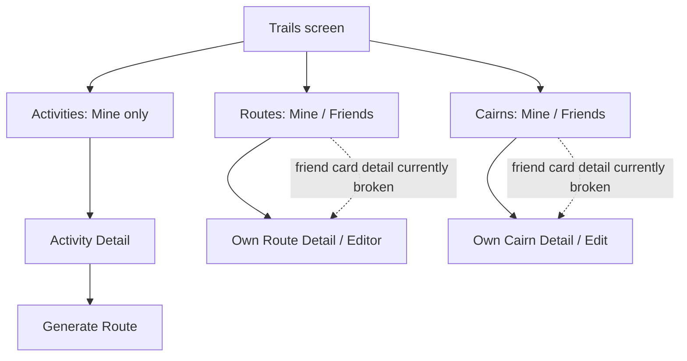

# Product flow

## Evidence-backed primary loop

- **FACT:** Solid edges are active.
- **FACT:** The selected-Route edges are visually present but semantically incomplete: screen-local selection does not reach the Activity payload.
- **HUMAN INTENT:** The reusable cycle should be `Route → Hike/Run → new Activity`, retaining provenance. Current code does not complete it.

## Activity lifecycle

**FACT | LOCAL HEAD ONLY:** duplicate Start/Finish protection, mode-aware recovery parity, and Running map-readiness behavior are committed at local HEAD but absent from the currently deployed OTA.

## Cairn loop

- **FACT:** Both paths create the same Marker domain object.
- **FACT:** Full Plant is offline-first, category/content/privacy capable; Running Quick Cairn is private, blank, and one-tap.
- **FACT:** deleting the Marker does not delete the Memory point or Fog.
- **HUMAN INTENT:** the Hike/Run divergence is not a locked product decision.

## Friends cross-cutting effects

- **FACT:** Friendship and Fog subscription are distinct relationships.
- **FACT:** current remove/block stops fresh friend-tier Routes/Cairns but does not stop Friend Fog.
- **PRODUCTION FACT:** missing subscription trigger further weakens intended authorization and the nominal cap.

## Memory and Fog source union

- **FACT:** Friend ownership is known before flattening; Activity/source provenance is not.
- **FACT:** overlaps are reconciled spatially, not by reference-counted explored cells.
- **FACT:** Home percentage is a point-count proxy, not exact unique explored area.

## Trails role

**FACT:** Trails currently combines history, library, management, friend content, search/filter/sort, and discovery-adjacent Cairn presentation. It is not itself a Route domain and it is not a bottom tab.

## Product loops

### Primary product loop

**FACT:** `Home → free Hike/Run → Activity → trace/metrics → Memory/Fog → history/detail` is the only complete end-to-end loop.

### Secondary loops

- **FACT:** `Activity → optional Route generation → Route editing/library` is complete through Route creation, but reuse into a new Activity is not.
- **FACT:** `Home/Hiking → Plant → Cairn → Trails/Memory` is complete for create/view, with inconsistent Activity linking and deletion semantics.
- **FACT:** `Friend request → friendship → friend Routes/Cairns` is active, with detail-routing and cache-revocation gaps.
- **FACT:** `Memory friend selection → friend Fog union` is active, with authorization/revocation and entitlement gaps.

### Management/library loops

- **FACT:** Trails Activities supports filter/sort/detail/local rename/delete/generate Route.
- **FACT:** Trails Routes supports Mine/Friends, search/filter/sort, own detail/edit/delete.
- **FACT:** Trails Cairns supports Mine/Friends, category/permission filters, sort, own detail/edit/delete.
- **FACT:** Settings owns profile, account/export, Memory reset, display preferences, and hidden diagnostics.

## Loop verdict

The proposed global model is mostly supported but must be qualified:

`ROUTE / FREE EXPLORATION → HIKE / RUN → ACTIVITY → TRACE / METRICS / CAIRNS → MEMORY / FOG → OPTIONAL ROUTE`

- **FACT:** Free exploration through Activity, trace/metrics, Memory/Fog, and optional Route works.
- **FACT:** Cairns are not consistently Activity-associated and are not part of the atomic session save.
- **FACT:** Route → new Activity identity/provenance is absent.
- **FACT:** Friends cross-cut Routes/Cairns through mutual friendship but Fog through separate subscriptions.
- **FACT:** Trails hosts history/library/management; it is not yet a coherent public discovery surface.
