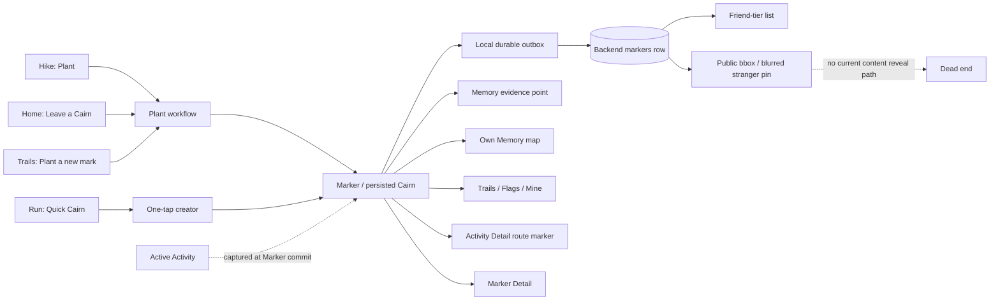
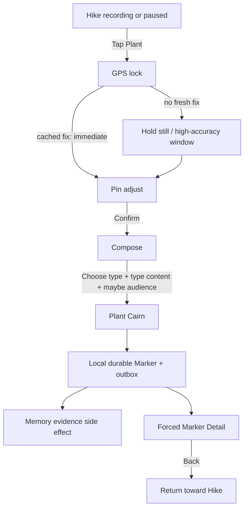

# PLANT CURRENT PRODUCT VERDICT

**Verdict: Plant contains a valuable Cairn core, but the current feature is not one coherent product.** Its strongest behavior is a locally durable, on-site trace that can be associated with an Activity and rediscovered on a map. Around that core, the implementation mixes field reporting, personal memory, friend sharing, public discovery, moderation, and historical media ideas. Several of those promises are incomplete or contradictory.

Plant should not be redesigned as a prettier version of the existing three-step form. Product decisions and correctness fixes must come first.

No Plant, Mark, Memory, Activity, visibility, backend, or shared-component implementation was changed during this audit.

## Plant in one sentence

Today, **Plant is a full-screen workflow that creates a persisted `Marker` at a GPS-confirmed location, optionally adds authored content and an audience, contributes a point to Memory, and may associate that marker with the Activity currently recording.**

That sentence is accurate but too broad for a healthy product definition. A clearer future definition is likely:

> Plant is the act of leaving a small, durable Cairn at the place where you noticed something, so you—or someone you intentionally share it with—can encounter that trace again.

That is a product direction, not a redesign specification.

## Audit scope and authority

### Authority read

The requested `CairnNZ_Project_Authority.md` is not present in this repository. The audit therefore distinguishes three evidence classes:

1. **Current behavior:** current app, backend, schema, persistence, and tests.
2. **Accepted product DNA:** `docs/VISUAL_SYSTEM.md`, `docs/VISUAL_MIGRATION_STATE.md`, `docs/VISUAL_ASSET_MANIFEST.json`, `docs/CAIRNNZ_VISUAL_ROADMAP.md`, and the accepted Hike/Run Product-DNA review.
3. **Historical intent:** `docs/design/r114-mark-redesign.md`, earlier Plant audits, public-marker discussion documents, and the archived AR Plant trace.

Where comments conflict with executable source, current executable source is treated as implementation truth. Where current source contains two contradictory executable behaviors, that contradiction is called out rather than rationalized.

### Current product DNA used for judgment

Cairn is a calm, exploration-first New Zealand outdoor product: a living field atlas in which movement becomes trace, trace becomes memory, and other people are present quietly rather than through a feed. Its accepted surfaces use:

- believable environmental presence and broad soft light;
- restrained forest, sage, stone, and off-white color roles;
- a clear surface ladder from environment to content to elevated card to sheet to active control;
- measured radii, glass only where atmosphere or layering warrants it, and little decorative noise;
- warm, plain language rather than fitness, CRUD, or social-posting jargon;
- shared typography, icons, controls, and calm state transitions;
- Activity as the same field atlas becoming a precise outdoor instrument.

Plant should be an intentional creation gesture inside that world—not a generic form launched from it.

## What Plant actually is

### Product interpretation

Plant is an **action**, not a persisted entity.

The persisted entity is `Marker`. “Mark” is also used as the user-facing noun in some screens, while “Cairn” is used as:

- the product metaphor for a marker;
- one of five marker subtypes;
- the one-tap Run action (“Quick Cairn”);
- the result of Plant (“Cairn planted”);
- the object named in detail and sync states.

“Flag” is a fourth user-facing label for the same stored objects in Trails and Activity Detail.

The implementation therefore mixes four naming layers:

| Name | Current reality |
| --- | --- |
| Plant | A three-step creation workflow and verb. Not stored. |
| Quick Cairn | A one-tap shortcut that creates the same `Marker` entity with `type=cairn`, no content, and personal visibility. Not a separate entity. |
| Mark / Marker | The actual persisted domain entity. “Mark” appears in compose and social code; `Marker` is the source type. |
| Cairn | Product metaphor, detail noun, Quick action, and also one `MarkerType`. |
| Flag | Trails tab and Activity Detail terminology for Marker records. |

This is not merely copy inconsistency. Users are being asked to understand distinctions that the data model itself does not make.

### Domain model



### Object and ownership map

| Object/action | Persisted? | Owner/reference | Map/later surface | Social? | Memory effect | Activity-linked? |
| --- | --- | --- | --- | --- | --- | --- |
| Activity | Local + backend | User; stable client Activity ID | Activity Detail, Trails | Route sharing is separate | Canonical movement evidence | Root record |
| Plant | No | Navigation workflow | None by itself | Audience chosen during workflow | Indirectly via created Marker | Captures active Activity only at commit |
| Quick Cairn | No | Run action | Toast only at creation | Always personal | Same Marker side effect | Explicitly calls `linkMarker` and also stores provenance |
| Marker / Cairn | Yes | User; client UUID + optional server numeric ID | Memory, Trails Flags, Activity Detail, Marker Detail | personal / group(friend) / public | Current store writes one `cairn` Memory evidence point | `originActivityClientId` |
| Marker type `cairn` | Field on Marker | Marker | Pin/type badges | Inherits Marker visibility | No unique effect | Inherits Marker link |
| Memory point | Yes | User | Fog/explored map | Friend fog can be subscribed | Is the Memory evidence | May also come from Activity/passive sources |
| Friend | Yes | Mutual user relation | Friends and shared content | Low-pressure relationship | Optional fog subscription is separate | No direct Activity ownership |
| Public Mark | Backend-seeded/current historical rows only | Creator, anonymized to others | Blurred public bbox pin | Like/report backend exists | No special effect | May retain origin |
| Like/report vote | Yes on backend | One permanent mutually exclusive vote per user/Mark | Counts exist in backend | Public-only intended | None | None |

## Intended Plant versus current Plant

### Recovered intent

The old AR implementation treated planting literally: place a Cairn in the world, leave a trace, and encounter it again. The current visual/product authority has moved away from AR but retained the valuable part of that idea:

> movement through the world can leave small, place-specific traces that become part of Memory and quiet shared presence.

The useful original intent was never “complete a marker database form.” It was “notice something here and leave a trace here.”

### Current reality

Current Plant is a GPS lock, map-pin adjustment, and structured form. It can represent at least two different jobs:

1. **Personal/authored trace:** a memory, note, or place worth returning to.
2. **Field report:** danger, junction, water, or hut information intended to help another person.

Those jobs have different urgency, content, lifecycle, trust, expiry, and audience needs. They currently share one form, one entity, one visibility control, and one default. That is the central product-model ambiguity.

The feature has also accumulated incomplete public, photo, voice, community-vote, immutable-public-snapshot, approximate-location, and location-name concepts. These are not all valuable merely because schema or comments preserve them.

## Complete current capability inventory

| Capability | Entry | User action | Data created | Where seen later | Status | Real user value |
| --- | --- | --- | --- | --- | --- | --- |
| Full Plant from Home | Home “Leave a Cairn” | Enter 3-step flow | Marker | Own detail, Trails, Memory | COMPLETE entry; downstream caveats | Medium. Useful outside Activity but expensive for a casual note. |
| Full Plant during Hike | Hike recording/paused dock “Plant” | Leave Activity UI; complete 3 steps | Marker with Activity provenance | Own detail; route map by provenance | PARTIAL | High concept value; current interruption and count mismatch reduce it. |
| Plant from Trails | Trails Flags empty CTA | Complete 3 steps | Marker | Same as above | COMPLETE entry | Medium. Useful for creating a remembered place, but on-site GPS requirement makes this odd as a library action. |
| Run Quick Cairn | Run recording/paused dock “Cairn” | One tap | Personal empty `cairn` Marker | Map/detail/list; Activity `markerIds` | COMPLETE creation | High while moving; weak later meaning because content is empty. |
| GPS acquisition | Full Plant | Wait/hold still; retry if needed | In-memory locked coordinate | Pin adjust only | COMPLETE | Necessary standalone; redundant work risk during an already-recording Activity. |
| Cached-fix fast path | Full Plant | None | Coordinate from Memory watcher or OS last-known | Pin adjust | COMPLETE | High if trustworthy; watcher path fabricates 10 m accuracy because cache lacks accuracy. |
| Five-second high-accuracy sample | Full Plant | Hold still | Fused coordinate | Pin adjust | COMPLETE | Medium/high standalone; cognitive and time cost outdoors. |
| Pin adjustment | Full Plant | Pan map up to 50 m; optional zoom/style; confirm | Adjusted coordinate | Marker | COMPLETE | Supporting. Valuable for object/place precision. |
| Type selection | Compose | Choose Danger/Junction/Water/Hut/Cairn | `type` | Pins, list, detail | PARTIAL | Potentially useful, but ontology is mixed and Hut cannot sync. |
| Title | Compose/edit | Type up to 30 characters | Encoded into `text` | Detail/list/sheets | COMPLETE create; BROKEN edit durability | Useful but should not necessarily block capture. |
| Note | Compose/edit | Type up to 200 characters during create | Encoded into `text` | Detail/list/sheets | COMPLETE create; BROKEN edit durability | Useful, with high outdoor interruption cost. |
| Personal visibility | Compose | Accept default or select “Just me” | `permission=personal` | Own surfaces only | COMPLETE | Core and privacy-safe. |
| Friends visibility | Compose | Select “Friends” | DB `permission=group` | Trails Friends list | PARTIAL/BROKEN | Potentially valuable; current map/detail journey is not end-to-end. |
| Public visibility | Compose | Disabled “Anyone” chip | None from clients | Historical/seeded public paths | DEAD/UNREACHABLE for creation | No current user value; communicates unavailable scope. |
| Photo | Compose copy/type hints only | No action exists | None | Nowhere | DEAD PROMISE | Potential future value, zero current capability. |
| Voice memo | Developer-only preview text; service/schema remnants | No production control | None through Plant | Nowhere useful | EXPERIMENTAL/UNREACHABLE | Unproven; should not occupy product scope now. |
| Offline-first create | Any create entry after coordinate chosen | Submit with weak/no network | Durable owner-scoped outbox + local placeholder | Detail/list with sync badge | COMPLETE for soft network failure | High and appropriate for NZ outdoor use. |
| Process-death outbox recovery | After local create commit | Reopen app | Reconstructed Marker placeholder | Own surfaces | COMPLETE | High trust value. |
| Compose draft recovery | Failed commit only | Retry/reopen after an explicit create failure | One per-user draft | Returns directly to content | PARTIAL | Helpful after failure; ordinary background/process kill before submit loses the draft. |
| Sync status | Saved detail/card | Read pending/syncing/failed badge | No new data | Detail/list | PARTIAL | Useful status, but “Retry” is inert in production. |
| Own Marker detail | Save success, Trails Mine, map | View content/location/type/audience/sync | None | Full-screen detail | COMPLETE view | Useful, though forced immediately after Plant increases interruption. |
| Edit own Marker | Own detail | Edit title/note/type/visibility | Local cache first | Own detail | BROKEN | Valuable behavior, but current server identity path does not persist modern Marker edits. |
| Delete own Marker | Own detail/map | Confirm delete | Tombstone + local removal + server delete | Removed if sync succeeds | PARTIAL | Necessary. Remote failure is suppressed, so deletion may later reappear. |
| Activity association | Full Plant or Quick Cairn during recording/paused state | Implicit | `originActivityClientId` | Activity Detail route filter | PARTIAL | Core relationship. Full Plant does not update Activity `markerIds`, so its count can be wrong. |
| Activity Detail rediscovery | Activity Detail | View route | Route-local Marker via origin or proximity | Activity map | PARTIAL | High value; count and map can disagree. |
| Own Memory-map rediscovery | Memory | Pan to own Marker; tap | None | `MarkDetailSheet` | COMPLETE in source | High and distinctly Cairn. Owner override keeps own content revealed. |
| Trails Mine rediscovery | Trails → Flags → Mine | Filter/sort/tap | None | `MarkerDetailScreen` | COMPLETE | Useful, but “Flags” terminology and filter density make it feel like administration. |
| Friend Mark list | Trails → Flags → Friends | Browse/tap | None | Card list | PARTIAL/BROKEN | Cards load, but tap routes to a detail screen that only searches own markers. |
| Friend Mark on Memory | Memory Friends scope | Expected map encounter | None | Intended map sheet | DEAD/UNWIRED | `MemoryMap` reads only the own `markers` slice, not `circleMarkers`. |
| Public stranger discovery | Memory camera bbox | See blurred anonymous pin nearby | None | Blurred pin only | EXPERIMENTAL/PARTIAL | Distinctive concept, but no content reveal; explored public rows disappear from this layer. |
| Like public Mark | Intended public detail | Like within 50 m | Permanent backend vote | Backend count | PARTIAL/PRODUCTION-UNREACHABLE | Low current value. Backend is real; production discovery does not reach a usable public detail. |
| Report public Mark | Intended public detail | Choose reason within 50 m | Permanent backend vote | Moderation count/status | PARTIAL/PRODUCTION-UNREACHABLE | Necessary only if public content launches. “Don’t like it” is not a sound abuse reason. |
| Hide foreign Mark | Intended shared detail | Confirm hide | Backend hidden-item row | Removed from future shared loads | PARTIAL/UNWIRED | Useful privacy control; production map handler currently only closes the sheet. |
| Marker contributes to Memory | Any successful create | Implicit | One deduplicated Memory evidence point | Explored fog | COMPLETE executable side effect, CONTRADICTORY authority | Product value unresolved; conflicts with explicit PlantScreen rationale that planting should not reveal fog. |

## Critical implementation truth

### Creation is genuinely local-first

`useMarkerStore.addMarker` persists a business entity to a per-user offline queue before presenting success. The queue uses a stable client UUID as both Cairn identity and idempotency key, survives process death, separates users, retries network/5xx failures, and uses tombstones to reconcile delete-before-create-ack races.

This is strong outdoor-product infrastructure and should survive.

### Hut creation is broken end-to-end

The frontend offers `hut` as one of five canonical types. Backend route logic recognizes `hut` for updates, but the Joi create/update schemas still list historical `shelter` and omit `hut` (`backend/src/middleware/schemas.js:36-39`, `59-63`). A Hut submission fails request validation and remains a failed local outbox row.

This was verified directly against the current schema:

```text
danger accepted
junction accepted
water accepted
hut rejected; allowed values are [cairn, danger, water, junction, scenic, supply, shelter, hazard, note, free]
cairn accepted
```

The core result is that `hut` is rejected. This is a P0 contract bug, not a redesign topic.

### Modern Marker edits do not persist

After sync, current Marker identity remains the client UUID in `marker.id`, while the numeric backend ID is stored separately in `marker.serverCairnId` (`app/src/store/useMarkerStore.ts:864-895`). `MarkerDetailScreen` calls `updateMarker(marker.id)`. `updateMarker` sends `PUT /api/markers/:id` using that client UUID; the backend update endpoint queries numeric `markers.id` and has no client-ID update route.

Even if a numeric ID happened to be passed, `updateMarker` never checks `res.ok`; it catches only thrown network errors. It mutates and persists local state first, then silently accepts a 404/400 response. The user sees a successful edit that reverts after backend hydration.

This is a P0 durability/trust defect.

### Failed create says “Retry” without a retry action

Hard 4xx create failures are intentionally retained and marked `failed`. `SyncBadge` renders the label “Retry”, but `MarkerDetailScreen` supplies no `onPress`, and the offline entity exposes no single-entry retry method. Only the Debug screen has a broad retry control.

For the known Hut failure, the normal user journey is therefore: “Planting succeeds” locally → Detail → “Retry” badge → no available repair. This should not survive.

### Delete is safer than edit, but still not fully truthful

Delete correctly prefers `/api/markers/client/:clientCairnId`, writes a tombstone, and removes pending create work. However, it removes the local Marker before the remote call and suppresses remote errors. A failed remote delete can later reappear after hydration. The online-only button reduces risk but does not eliminate weak-network races.

## Current user journeys

### 1. Plant during Hike



Current behavior:

- Activity tracking continues while Plant is on top of the navigation stack. Plant does not explicitly pause it.
- The Hike map and operational chrome are replaced by three full-screen steps.
- Plant starts or reuses a separate location-acquisition path; during an active Activity, a slow-path GPS lock can run an additional BestForNavigation watcher for up to five seconds.
- The pin coordinate is frozen after GPS lock and can be manually nudged within 50 m. It is committed when the user eventually submits, even if the user continued walking meanwhile.
- At commit, the Marker store detects the live or paused Activity and writes its stable client Activity ID as provenance.
- Unlike Run Quick Cairn, full Plant does not call `tracking.linkMarker`, so the session’s `markerIds` count can omit it even though Activity Detail’s provenance filter later shows it on the route.
- Success replaces Plant with Marker Detail. Back does not need to traverse the composer, but the user is still taken away from the live map for an additional screen.

Does it feel like “I noticed something and left a trace here”? **Only at the endpoints.** The initial intent and final durable object do. The middle feels like precise form administration.

Does Plant deserve its prominent Hike action today? **The concept does; the current full flow does not fully earn the prominence.** It is too interruptive for frequent use and has correctness gaps in type, Activity count, edit, and social rediscovery.

### 2. Plant while Hike is paused

The same button remains available and the same full flow opens. Activity status stays paused, so elapsed/route behavior follows existing Activity pause contracts. Plant itself does not alter pause state.

This is supported, but the UI does not tell the user whether the Cairn is anchored to the pause position, current device position, or eventual save position. It uses the Plant GPS lock/pin coordinate, not the pause pin.

### 3. Plant from Home

```text
Home → Leave a Cairn → GPS lock → pin adjust → compose → local save → Marker Detail
```

This is end-to-end for own personal/friend creation except Hut. It has no Activity provenance. Requiring the user to be physically on-site is coherent with the current GPS design, but the Home label does not explain that this is an on-site action rather than a map annotation tool.

### 4. Plant from Trails

```text
Trails / Flags / Mine empty state → Plant a new mark → same on-site full flow
```

This route is reachable only from the empty state, not as a persistent list action once Marks exist. It is semantically odd: a library surface offers a location-now capture action, but only when empty.

### 5. Run Quick Cairn

```text
Run recording or paused → tap Cairn → use last canonically accepted Activity coordinate
→ durable personal empty Cairn → link to session markerIds → toast → remain in Run
```

This is the best outdoor interaction in the current feature. It preserves movement, uses Activity’s trusted location rather than launching another GPS sampler, and gives immediate feedback.

Its weakness is deferred meaning: it creates an untitled, note-less generic Cairn with no explicit follow-up affordance. Tomorrow it can look like a blank pin whose reason has been forgotten.

### 6. View own Cairn later

Supported paths:

- Memory map own pin → shared Mark detail sheet;
- Trails → Flags → Mine → Mark card → full Marker Detail;
- Activity Detail → route-associated pin;
- Hike live map, where own markers are present.

This is enough to give own Plant data durable value, though the terminology and count mismatch weaken continuity.

### 7. View a friend Cairn

Current path:

```text
Mutual friend shares at Friends tier
→ /api/circle/markers
→ Trails / Flags / Friends card
→ tap card
→ MarkerDetailScreen searches only own markers
→ “Cairn not found”
```

The Memory map does not currently merge `circleMarkers` into the marker layer, so the intended ambient map encounter is also absent. Friend sharing is therefore not a complete product capability.

### 8. View a public Cairn

Client creation is disabled and rejected server-side. Existing seeded/historical public rows can be fetched by viewport as anonymous type/coordinate/time only. They render as blurred stranger pins near the map center while unexplored. The client has no public detail fetch containing content, and explored public-stranger rows are filtered out of the blurred layer without being promoted into the revealed marker collection.

There is no complete current public journey.

### 9. Offline and failure

- GPS and content entry do not inherently require network.
- Map tiles may be absent offline; the pin step has no explicit offline-map state.
- Create commits locally before sync and survives process death.
- A transient network failure remains pending and retries on network/foreground signals.
- A hard 4xx stays locally failed with no normal user repair path.
- If local storage itself fails, Plant retains an in-memory draft only while mounted and attempts to save one failed draft to the same storage subsystem.
- Background/process kill before submit loses the ordinary compose draft because drafts are persisted only after commit failure.

## Outdoor interruption cost

### Minimum full Plant

For a non-hazard personal trace during Hike:

1. Tap Plant.
2. Wait for cached GPS or hold still for up to the sampling window.
3. Tap Confirm.
4. Scroll/select `Cairn` because `Danger` is the default.
5. Tap a text field.
6. Type at least a title or note.
7. Tap Plant Cairn.
8. Back out of the forced Detail screen to regain Activity context.

This is at least five deliberate taps, one horizontal selection, typing, and two context changes. A realistic completion is roughly 15–40 seconds, longer in rain, glare, gloves, weak GPS, or one-handed use.

Friend sharing adds an audience decision. A field report often adds both type selection and explanatory text. Pin adjustment adds map manipulation.

### Quick Cairn

One tap, no typing, no context loss, typically under two seconds.

### Judgment

The full flow does not respect frequent use while moving. It is viable for an occasional deliberate stop, but not as Hike’s routine “noticed something” gesture. The current flow front-loads enrichment and audience decisions that could occur after the durable spatial trace exists.

## Location semantics

### What coordinate is used

- Full Plant captures a GPS anchor during step 1.
- It may reuse a recent Memory watcher fix, an OS last-known fix, or a five-second BestForNavigation sample.
- The user can move the pin no more than 50 m from the anchor.
- The coordinate is fixed after pin confirmation and committed later from draft state.
- Quick Cairn uses Run’s last canonically accepted Activity coordinate if it is no more than 30 seconds old.

### What the user might assume incorrectly

- “The Cairn is where I pressed Plant.” Not necessarily: it is where the subsequent GPS lock/pin step resolves.
- “The Cairn follows me until save.” It does not; location freezes before composition.
- “Accuracy shown in the lock/pin flow is stored with the Marker.” It is not. `accuracyM` stays in draft; Plant writes `gpsAgeS: 0` and `approximate: false`, but neither captures the actual fused accuracy.
- “A cached Activity-quality fix retains its measured accuracy.” The Memory watcher cache lacks accuracy, so Plant assigns 10 m for presentation.

The 50 m nudge is reasonable for correcting a feature just off the track. It also means a Plant-created Memory point can represent a place the user did not physically traverse, strengthening the argument that Marker placement should not silently be Memory authority.

## Plant, Quick Cairn, Mark, and Memory

### Plain-language distinction today

- **Plant:** create a content-bearing or report-like Marker through a full workflow.
- **Quick Cairn:** create the same Marker class instantly, as an empty personal `cairn` subtype.
- **Mark/Marker:** the stored object both workflows create.
- **Cairn:** sometimes the general Mark object, sometimes the generic authored-trace subtype.
- **Memory:** the spatial record of explored places, fed by Activity, passive location, and currently every Marker creation.

### Are multiple creation concepts justified?

Two interaction depths are justified: quick capture while moving and deliberate composition while stopped. Two entities are not. Current source correctly uses one entity, but the naming makes them sound like different product objects.

The better conceptual model is likely one Cairn/Mark entity with two creation modes:

- quick capture now;
- optional enrichment when stopped or later.

That recommendation does not decide whether field reports belong in the same entity; that is a separate product decision.

### Memory relationship

Current executable source says Marker creation calls `recordMemoryEvidence(source: 'cairn')`, producing a locally durable, spatially deduplicated point. Current `PlantScreen` comments explicitly say the old fog-unlock effect was removed because users did not want planted Cairns creating reveal circles and “only hikes should unlock fog.” Both statements cannot be true as a product contract.

Product judgment: **Memory should describe grounded exploration; Plant should annotate it.** A successfully on-site Plant can be supporting evidence, but it should not be an implicit alternate way to paint Memory—especially after a 50 m pin move. This needs an explicit owner decision before redesign or logic change.

## Content model

| Field | Source | Required? | Later use | User benefit | Interaction cost | Classification |
| --- | --- | --- | --- | --- | --- | --- |
| Client Cairn ID | System UUID | Yes | Idempotency, sync, tombstone, identity | Trust/durability | None | SYSTEM-ONLY / ESSENTIAL |
| Server Cairn ID | Backend | Eventual | Backend mutation/votes | Synchronization | None | SYSTEM-ONLY / ESSENTIAL |
| Origin Activity client ID | Active/paused tracking store at commit | No | Activity route association | Connects trace to journey | None | ESSENTIAL when in Activity |
| GPS anchor lat/lng | GPS/OS/cache | Yes for full Plant | Nudge boundary only | On-site authority | Wait | SYSTEM-ONLY / USEFUL |
| Final lat/lng | GPS + optional user nudge | Yes | Map, proximity, backend | Core place meaning | Confirm/map manipulation | ESSENTIAL |
| Actual accuracy | Sampler | No; not persisted | None | Could explain confidence | None after acquisition | LOST/REDUNDANT AS CURRENTLY HANDLED |
| `approximate` | Caller/system | Optional; full Plant always false | Pin/card presentation | Could warn uncertainty | None | LOW VALUE until truthful |
| `gpsAgeS` | Caller/system | Local only; full Plant always zero | No meaningful reader found | None today | None | REDUNDANT |
| Altitude | Location/backend field | Optional | Little/no Plant presentation | Low for annotation | None | SYSTEM-ONLY / LOW VALUE |
| Region code | Client | Required by frontend shape | Own region filters; not backend | Organizational | None | LEGACY/INCONSISTENT (`''` in full Plant) |
| Type | User | Yes | Pin visual, filters, detail | Useful for field information | One decision + horizontal scan | USEFUL, MODEL NEEDS REDEFINITION |
| Title | User | One of title/note required | Card/detail headline | Strong rediscovery cue | Typing | USEFUL, not necessarily pre-save essential |
| Note/body | User | One of title/note required | Card/detail content | Context for future self/others | Highest typing burden | USEFUL / OPTIONAL DURING CREATION |
| Visibility | User; defaults personal | Yes | Sharing query/filter | Privacy/audience | One consequential decision | ESSENTIAL, but likely not during moving capture |
| Author | Auth state/backend | Yes | Ownership/friend name | Trust/context | None | SYSTEM-ONLY / ESSENTIAL |
| Created time | System | Yes | Detail/sort | Rediscovery context | None | SYSTEM-ONLY / ESSENTIAL |
| Voice URI/duration | Local-only remnants | No | No production playback path from Plant | Unproven | Permission + recording time | LOW VALUE / DEFER |
| Photo/media | Not implemented | No | None | Potentially high memory/context value | Permission/capture/upload | NEEDS PRODUCT DECISION |
| Public snapshot | Backend/local model | Only historical public | Frozen external view | Intended public trust | High model complexity | LOW CURRENT VALUE / DEFER |
| Sync state | Offline entity | System | Badge | Critical trust feedback | None | ESSENTIAL, interaction incomplete |

### Title/body encoding

The database has one `text` field. Plant combines title and body using U+001E. Shared readers decode it correctly, which is an effective compatibility adapter. It is still technical debt:

- title/body have different product roles but no schema identity;
- old/foreign text needs fallback interpretation;
- any raw reader can leak the separator or misclassify body-only content;
- the workaround has already required a dedicated cross-component invariant.

Keep compatibility until a schema migration is justified; do not make this encoding part of the future product concept.

## Photo and voice

### Photo

Photo is not a current Plant feature. No Plant picker, draft field, upload, offline media queue, permission state, detail renderer, or backend relationship exists. Yet current UI says “a photo if you’d like,” and the Cairn type hint says “A note, photo, or memory.” `photoUrls` was explicitly removed because it had zero readers.

This is misleading current product copy and historical scope, not an incomplete button.

Product judgment: a photo could strengthen a place trace and reduce typing, but only if Cairn chooses it as a core capture medium and builds offline upload, durability, privacy, and rediscovery end-to-end. Otherwise every photo promise should disappear.

### Voice

A local voice recording service and dormant schema fields exist, but production Plant has no control, upload contract, or later listening journey. The compose screen shows a developer-only preview notice. Voice is more likely historical/experimental baggage than proven core value.

Recommendation: defer and remove from the redesign scope unless field evidence specifically demonstrates one-handed voice capture is preferable to photo/text.

## Social and visibility model

### What currently happens

- New full Plants default to **Just me**.
- Users can choose **Friends**; backend stores legacy `group` and circle responses normalize it conceptually to friend.
- “Friends” means all mutual friends at the content-query layer, not the capped Memory-fog subscription set.
- **Anyone** is visible but disabled. Backend independently rejects client public writes.
- Existing public Marks are anonymous to other users.
- Public like/report backend rules require proximity, recent timestamp, nonce, rate limits, and one irreversible vote per user/Mark.
- There are no comments.

### Is it coherent?

Privacy default is coherent and safe. The rest is not yet a product:

- Friends cards expose shared content in a global Trails list, even though visibility utilities and product language also frame content as something revealed by explored/friend fog.
- Friend cards cannot open their detail.
- Friend Marks are absent from the Memory map that should make ambient shared presence meaningful.
- Public creation is unavailable.
- Public stranger pins have no reveal path.
- Like/report/hide actions have backend or component pieces but no complete production journey.

This does not currently turn Cairn into a social feed—but only because the social system is largely unfinished. Adding engagement polish before defining discovery semantics would push it in the wrong direction.

### Product judgment

- Personal should remain the safe default.
- Friend sharing can be valuable as low-pressure ambient presence, but only after choosing whether discovery is spatial or library-based.
- Public should remain hidden/deferred until creation, reading, moderation, lifecycle, and privacy are one coherent system.
- Likes add little to personal memory and encourage engagement behavior. Do not prioritize them.
- Reports are necessary infrastructure only if public user content is launched. “Don’t like it” should not be a moderation reason.

## Why a Plant matters tomorrow

For an own, titled/note-bearing Cairn, there are three credible future values:

1. **Spatial rediscovery:** encounter it again on the Memory map.
2. **Journey memory:** see it along the Activity where it was created.
3. **Practical return:** find a water source, hut, junction, hazard, or personal place note later.

That is enough to justify the core entity.

Quick Cairn has weaker tomorrow-value because it is empty. Without later enrichment, place-name context, photo, or a clear “why I marked this” cue, it becomes dead data more easily.

Friend/public Plants do not currently deliver credible tomorrow-value because their main discovery/detail journeys are incomplete.

The mandatory answer is therefore:

> The user should care tomorrow because a Plant reconnects a remembered fact or feeling to the exact journey and place where it happened. Current own Marks partially achieve this; current shared/public Marks do not.

## Value matrix

| Capability/concept | User value | Frequency | Unique to Cairn | Cognitive cost | Social value | Memory/retention value | Technical complexity | Class |
| --- | --- | --- | --- | --- | --- | --- | --- | --- |
| Durable on-site personal Cairn | High | Medium | High | Low after capture | Low | High | Medium | CORE |
| Spatial rediscovery on Memory | High | Medium | High | Low | Medium | High | High | CORE |
| Activity provenance | High | Whenever planted in Activity | High | None | Low | High | Medium | CORE |
| Quick Cairn | High in motion | Medium/high | Medium/high | Very low | Low | Medium until enriched | Medium | CORE |
| Concise title/note | Medium/high | Medium | Medium | Medium/high outdoors | Medium | High | Low | SUPPORTING |
| Bounded pin correction | Medium | Occasional | Medium | Medium | Low | Medium | Medium | SUPPORTING |
| Personal visibility default | High trust value | Always | Medium | Very low | Low | Medium | Low | CORE |
| Friend-tier sharing | Medium potential | Occasional | High if spatial | Medium | High potential | Medium/high | High | SUPPORTING, currently broken |
| Field-report types | Medium/high in specific moments | Low | Medium | Medium | High practical value | Medium | High lifecycle burden | SUPPORTING / REDEFINE |
| Generic `cairn` type | High conceptual fit | Medium | High | Low | Medium | High | Low | CORE concept, naming conflict |
| Photo | High potential | Medium | Medium | Low/medium | Medium | High | High | NEEDS PRODUCT DECISION |
| Voice memo | Unknown | Likely low | Low/medium | Medium | Low | Unknown | High | OPTIONAL / DEFER |
| Public mystery pins | Medium future potential | Unknown | High | Low viewer cost | Medium | Low/medium | Very high | OPTIONAL / DEFER |
| Like | Low | Unknown | Low | Low | Engagement-heavy | Low | Medium/high | LOW VALUE |
| Report | Necessary only for public | Rare | Low | Medium | Safety/moderation | None | High | SUPPORTING INFRASTRUCTURE, hidden until public |
| Immutable public snapshot | No current user value | None | Low | High conceptual cost | Future trust | Low | High | LOW VALUE / DEFER |
| Plant-created Memory point | Ambiguous | Every Plant | Low | Invisible | Low | Can distort Memory | Medium | HARMFUL until decided |
| Default Danger | Negative for general Plant | Every Plant | Low | Forces correction | Can create false semantics | Negative | Low | HARMFUL |
| Disabled Anyone chip | None | Every compose | None | Adds confusion | None | None | Low | HARMFUL |
| Forced post-save Detail | Low immediate value | Every full Plant | Low | Adds interruption | None | Low | Low | LOW VALUE |

## UI and Product-DNA fit

### What works

- Day palette uses Cairn’s off-white, forest green, quiet borders, restrained type colors, and shared icon family.
- Pin adjustment keeps the map central and feels closer to a field instrument than a generic form.
- `MarkForm` unifies creation and editing.
- `MarkCard`, `MarkDetailSheet`, `CairnPinV10`, `SyncBadge`, and shared map theming establish useful continuity among later surfaces.
- The saving state is calm and avoids celebratory/gamified noise.
- Default personal visibility is clear and low pressure.

### Where it leaves the family

1. **The composition step is a generic CRUD form.** Environment disappears; type, two text areas, three audience buttons, and a submit button become the whole experience.
2. **It is pill-heavy.** Five type chips plus three equal audience controls treat distinct decisions as one row of selectable capsules.
3. **The surface ladder is flat.** Page, input, preview notice, and controls do not establish the environmental → content → active-control hierarchy evident in accepted Cairn surfaces.
4. **The feature uses static day `Colors` inside child components.** Only roots and some later surfaces consume `useVisualTheme`. The captured night compose has a nearly invisible dark title and inconsistent white controls on slate.
5. **The CTA is locally implemented.** Plant does not use the shared primary action contract.
6. **The language is internally inconsistent.** “Leave a mark,” “Plant Cairn,” “Who can see this,” “Tell whoever finds this,” “Flags,” and “Cairn Detail” describe different mental models.
7. **Unavailable concepts are visible.** Anyone is a disabled choice; photo is promised; developer builds show a voice preview.
8. **Map continuity is broken after confirmation.** The user moves from Activity/map world to a detached form and then to a full detail page.

### Night evidence

The current night capture is not a tasteful variation problem. `Leave a mark` becomes close to unreadable because the header uses static dark day text over the night root. Several field labels and states are also low contrast. This is a shared-theme contract breach and must be fixed in any future implementation, but no UI change was made in this audit.

## Shared-component analysis

| Role | Current component/token | Current Plant usage | Judgment for future work |
| --- | --- | --- | --- |
| Theme root | `useVisualTheme` | Plant root and Marker Detail use it | KEEP; child steps must consume semantic theme roles too. |
| Map theme | `useMapTheme`, shared Mapbox config | Pin and detail use shared map styles | KEEP. |
| Back action | `BackButton` | GPS/content/detail use it; pin uses related local treatment | KEEP / standardize role. |
| Iconography | `Icon`, `CairnIcon`, Cairn pin family | Used broadly | KEEP. |
| Creation/edit form | `MarkForm` | Shared between compose and detail edit | KEEP BUT SIMPLIFY after product decisions. |
| List record | `MarkCard` | Trails Flags list | KEEP; correct destination/data source first. |
| Map detail | `MarkDetailSheet` + `BottomSheetFrame` | Own/friend/public forms intended | KEEP structure; remove stale/unreachable social variants until real. |
| Full detail | `MarkerDetailScreen` | Forced after save and from Trails | KEEP as later rediscovery surface; fix identity/source contracts. |
| Pin language | `CairnPinV10`, tier/type resolvers | Memory/detail | KEEP. Distinguishes place/type without new skins. |
| Sync state | `SyncBadge` | Detail/list | KEEP; “Retry” must be a real action or different copy. |
| Primary CTA | `PrimaryButton` exists | Not used; local TouchableOpacity | ADOPT in redesign if interaction role matches. |
| Content surface | `ContentSurface` / semantic surfaces | Not used in compose | ADOPT selectively; avoid card grid. |
| Activity sheet/action family | Activity shared chrome/sheets/actions | Not used by Plant | REUSE interaction roles where Plant is hosted by Activity. |
| Visibility controls | Local `VisChip` in `MarkForm` | Used create/edit | REDEFINE after social decision; do not preserve equal three-option row by default. |
| GPS/pin controls | Local Plant components | Used only here | KEEP behavior, simplify entry/context before abstracting. |

## Historical baggage

| Historical element | Evidence/current state | Judgment |
| --- | --- | --- |
| AR placement | Archived v0.2.4 Plant was an ARKit/Unity placement chain; current `PlantScreen` explicitly says GPS-based, no AR | LEGACY. Do not reintroduce to preserve the Plant metaphor. |
| `free`, `scenic`, `supply`, `shelter`, `hazard`, `note` types | Still accepted by backend schema; current UI uses five different types | LEGACY contract debris. |
| Photo-as-scenic replacement | Type comments/copy promise photo; implementation removed `photoUrls` | INCOMPLETE historical intent. |
| Voice memo | Service + schema columns + local Marker fields; no production Plant control or upload/read journey | EXPERIMENTAL baggage. |
| Public snapshot | Built for first-public immutable content; client public writes are now forbidden | DORMANT complexity. |
| Public community votes | Backend is substantial; current production content journey cannot reach it coherently | DORMANT/overbuilt relative to product. |
| `group` versus `friend` | Marker DB uses legacy `group`; UI says Friends; API normalizes inconsistently by surface | Compatibility debt; keep wire adapter, not user terminology. |
| `regionCode` | Frontend-only; full Plant writes empty string, Quick Cairn writes actual region | LEGACY/inconsistent. |
| `gpsAgeS` and `location_name` | Fields/comments remain; no useful end-to-end consumption | DEAD/unfinished. |
| `sessionId` alias plus origin Activity ID | Quick path still passes legacy alias; store translates to current provenance | Compatibility debt. |
| Flags naming | Trails and Activity Detail call Cairns “flags” | Historical product vocabulary. |
| Dev preview descriptions | Some dev scenario copy still says friend Marks have Like/Report despite current public-only gate | Stale QA authority. |

## Meaningful error, edge, and privacy risks

### High impact

- Hut hard-fails backend validation.
- Modern edits appear saved but cannot address the backend row by client UUID.
- Failed create’s “Retry” has no user action.
- Friend card → detail is broken.
- Friend Marks are not wired into Memory.
- Full Hike Plant route count can disagree with displayed route Markers.
- Plant writes Memory evidence despite screen-level authority saying it must not reveal fog.

### Medium impact

- Ordinary compose state is not durable until a commit fails.
- Location freezes before content composition; a moving user can save behind their current location without explicit explanation.
- Actual accuracy is not persisted; `approximate=false` overstates confidence after all accepted paths.
- A second short high-accuracy watcher may run during Hike even though Activity already owns a current high-quality fix.
- Delete can reappear after a network race because remote failure is suppressed.
- Public/friend visibility semantics differ between list, fog, and map layers.
- Hard-failed outbox entries can remain indefinitely.
- Test coverage is contract-heavy around Activity/Memory but sparse for actual Plant journeys, Marker mutations, category parity, and cross-slice detail routing.

### Lower impact

- Double submit is guarded by UI state and a `submitting` check, but two presses before the state update could create two independent client UUIDs. This is a plausible edge, not a demonstrated common bug.
- Pin map has no explicit weak-network/offline tile state.
- Account state is scoped in durable storage and Marker hydration; no direct cross-account leak was found in the current create path.

## Product decision table

| Current thing | Keep? | Why | Future action |
| --- | --- | --- | --- |
| One persisted location trace | Yes | This is the product’s strongest place-memory unit | KEEP / POLISH |
| Plant as verb | Probably | Natural Cairn language for deliberate creation | KEEP, contingent on noun decision |
| Marker as internal entity | Yes | One entity already supports both creation depths | KEEP AS IS internally |
| Four user nouns (Cairn/Mark/Marker/Flag) | No | Creates false object distinctions | MERGE |
| Quick Cairn | Yes | Best moving-state interaction | KEEP / POLISH |
| Full three-step Plant as default Hike action | Not as-is | Too interruptive and front-loads enrichment | SIMPLIFY |
| GPS authority and 50 m nudge | Yes in principle | Protects on-site meaning and precision | KEEP BUT SIMPLIFY / context-aware reuse |
| Separate Plant GPS watcher during active Activity | Not by default | Activity already has authoritative fresh location | REDEFINE after ownership proof |
| Personal default | Yes | Correct privacy posture | KEEP AS IS |
| Friends audience | Yes only if completed | Fits ambient shared presence | KEEP / REDEFINE |
| Anyone disabled chip | No | Advertises unavailable functionality | HIDE |
| Public creation | Not now | No complete discovery/moderation journey | DEFER |
| Public stranger mystery | Maybe later | Distinctive Cairn exploration idea | NEEDS PRODUCT DECISION |
| Like | Probably not | Generic engagement with weak memory value | REMOVE or DEFER |
| Report infrastructure | Only with public | Necessary safety mechanism, not creation value | HIDE / DEFER |
| “Don’t like it” report reason | No | Conflates preference with abuse/inaccuracy | REMOVE |
| Immutable public snapshot | Not now | High complexity with no current write path | DEFER |
| Danger default | No | Biases general traces into safety reports | REDEFINE |
| Danger/Junction/Water/Hut/Cairn in one ontology | Not as-is | Mixes report categories with authored-trace identity | REDEFINE / possibly MERGE or MOVE |
| Title | Yes | Strong later cue | KEEP, make optional at capture |
| Note | Yes | Adds practical/memory meaning | KEEP, optional or later |
| Required content before save | No for core trace | Causes interruption and makes Quick Cairn a separate-feeling product | SIMPLIFY |
| Photo promise | No without implementation | Current copy is false | HIDE now; NEEDS PRODUCT DECISION for future |
| Voice memo scope | No evidence yet | High complexity and no current journey | DEFER / REMOVE dormant UI |
| Forced post-save full Detail | Probably no | Extends interruption after success | MOVE to optional review |
| Marker → Memory evidence | Not without explicit decision | Contradicts movement-authority intent and pin nudge | NEEDS PRODUCT DECISION |
| Activity provenance | Yes | Makes a trace part of a journey | KEEP / FIX |
| Activity `markerIds` parallel link | Keep only if needed | Currently duplicates provenance and diverges | MERGE authority or make atomic |
| Own map/list/detail rediscovery | Yes | Answers why the action matters tomorrow | KEEP / FIX |
| Friend list with broken detail | No as-is | Creates a dead-end social promise | FIX OR HIDE |
| Local-first outbox/idempotency/tombstones | Yes | Excellent outdoor reliability foundation | KEEP AS IS |
| Inert Retry badge | No | Damages trust | REDEFINE / FIX |
| Edit/delete | Yes | Necessary ownership controls | KEEP / FIX correctness |
| U+001E title/body adapter | Temporarily | Compatibility function is working | KEEP until schema migration, then REMOVE |

## Prioritized findings

### P0 — Product correctness

1. **Modern Marker edit is false-success.** Client UUID is sent to a numeric-ID endpoint, and non-OK responses are not checked. Edits can revert after hydration.
2. **Hut is an offered but invalid create type.** Backend validation rejects it; the resulting hard-failed local row has no normal retry/repair journey.
3. **Failed sync recovery is false affordance.** `SyncBadge` says “Retry” but is inert in Marker Detail.
4. **Friend sharing is not end-to-end.** Friend cards route to an own-only detail store; friend Marks are not rendered by Memory.
5. **Shared discovery semantics conflict.** Trails exposes friend content globally while visibility logic describes fog-gated encounter; public stranger rows cannot reveal.
6. **Activity association has two diverging authorities.** Full Plant writes origin provenance but not `markerIds`; Quick Cairn writes both. Detail map and count can disagree.
7. **Memory authority contradicts itself.** Marker store writes `cairn` Memory evidence while Plant’s explicit current rationale says planting must not reveal Memory fog.

### P1 — Product and information architecture

1. Plant has no single primary job: personal memory and field reporting are mixed.
2. Plant/Quick Cairn/Mark/Cairn/Flag naming is not understandable as one system.
3. Full Plant is too interruptive for the prominent Hike action.
4. Danger default creates incorrect semantic pressure for ordinary traces.
5. Type taxonomy mixes event severity, infrastructure, topology, and authored memory.
6. Active Hike does not reuse its accepted coordinate; the slow path can briefly duplicate high-accuracy location work.
7. Content and audience are required before durable full capture; ordinary drafts are not crash-durable.
8. Quick Cairn preserves movement but has weak later meaning and no enrichment cue.
9. Photo and public promises are visible despite being unavailable; voice is dormant scope.
10. Public/like/report/snapshot complexity is ahead of product value and production reachability.
11. Location confidence is shown transiently but not stored truthfully.
12. Night-theme creation is materially unreadable because child surfaces bypass semantic themes.
13. Forced Marker Detail delays return to Activity without adding required completion work.

### P2 — Visual and interaction polish

1. Compose has a flat, generic-form hierarchy rather than environment → record surface → active control.
2. Type and visibility are over-pillified and visually co-equal despite different consequence.
3. Local Plant CTA and map controls diverge from accepted shared action roles.
4. Static colors, borders, and white fields are not consistently theme-aware.
5. Type row clipping communicates scroll but makes the fifth concept easy to miss—especially because the default is Danger.
6. Raw latitude/longitude dominates later metadata without translating place into human meaning.
7. Copy shifts among mark, Cairn, whoever finds this, Friends, Anyone, and Flags.
8. The developer-only voice box becomes visual noise in QA builds and should not be mistaken for production capability.

## What should survive a redesign

- One durable, user-owned, location-bound Cairn/Marker entity.
- Stable client identity, local-first outbox, idempotent server create, owner scoping, tombstones, and process-death recovery.
- Personal visibility as the default.
- Activity provenance captured atomically when created during a live or paused Activity.
- Quick Cairn’s one-tap, stay-in-Activity interaction character.
- Optional bounded pin correction for deliberate placement.
- A concise optional title/note that makes tomorrow’s rediscovery meaningful.
- Own Memory-map, Activity Detail, Trails list, and detail rediscovery—after their contracts agree.
- Shared `MarkForm`, `MarkCard`, `MarkDetailSheet`, `CairnPinV10`, `SyncBadge`, icons, map themes, and semantic token roles where their product roles remain valid.
- Calm feedback and low-pressure social posture.
- Friend sharing only if it becomes a real ambient, end-to-end journey.

## What should probably not survive

- A single first-class flow trying to be both personal memory capture and public hazard reporting.
- Danger as default.
- The full three-step form as the routine moving-state interaction.
- Plant/Mark/Marker/Cairn/Flag vocabulary soup.
- Required typing before a durable trace can exist.
- Disabled Anyone control.
- Photo promises without a photo product.
- Voice memo preview/remnants in active scope without evidence.
- Like as a core Plant value.
- “Don’t like it” as a report reason.
- Immutable-public-snapshot complexity while public creation is disabled.
- An inert “Retry” affordance.
- Forced post-save Detail as the only success path.
- Plant creating Memory exploration as an accidental side effect.
- Local hard-coded day styling and parallel button/control variants.

## Open decisions for the product owner

These are genuine decisions where source evidence cannot choose on the owner’s behalf. A recommendation is included so they are actionable.

1. **What is the user-facing object?**
   - Recommendation: one “Cairn” object, “Plant” as the deliberate verb, “Quick Cairn” as a capture mode, `Marker` internal only, retire “Flag” from user-facing copy.

2. **Is the core job personal trace or field report?**
   - Recommendation: make personal place trace the core. Treat hazard/junction/water/hut reporting as an optional structured layer or a separate action contract, because trust and lifecycle differ.

3. **Does on-site Plant count as Memory exploration?**
   - Recommendation: no by default. Let Activity/passive movement own explored territory; let Cairns annotate it. If product chooses yes, document the 50 m nudge and visual footprint explicitly.

4. **How should Friends discover a shared Cairn?**
   - Recommendation: choose ambient spatial discovery as the differentiator. A global Friends list may remain an index, but it should not reveal content that the map/fog model says has not been encountered.

5. **Is photo a core capture medium?**
   - Recommendation: decide before UI redesign. Photo has high potential for low-typing place memory, but only ship it with offline durability, upload, permissions, privacy, detail rendering, and deletion.

6. **Is public user-created content in near-term scope?**
   - Recommendation: no. Keep it deferred until creation, discovery, reveal, moderation, expiry, and privacy are a single validated product. Preserve backend work only where cheap; do not expose dead controls.

## Recommended redesign direction

High-level principles only—no screens are designed here.

1. **Define one object and two interaction depths.** Quick capture while moving; deliberate enrichment while stopped or later.
2. **Commit place before prose.** The core action should become durable with minimal interruption; title, note, type, media, and audience should not all block capture.
3. **Separate trace identity from report taxonomy.** Do not ask one type row to explain memory, hazards, infrastructure, and topology.
4. **Use Activity context.** During Hike/Run, reuse the current trusted Activity location and preserve the map; acquire a separate lock only when needed.
5. **Make tomorrow-value explicit.** Every capture must have a clear rediscovery path in Memory and Activity, plus a lightweight way to add meaning to Quick Cairns.
6. **Finish personal before social, and friend before public.** Hide incomplete tiers instead of presenting unavailable or dead-end controls.
7. **Make durability truthful.** Saving, pending, failed, retry, edit, and delete must reflect actual backend/local state.
8. **Let Cairn DNA shape the interaction.** Use semantic themes, accepted material roles, shared controls, calm feedback, and spatial continuity—not a generic form skin or copied freeze-page layout.
9. **Reduce scope aggressively.** Remove dormant photo/voice/public/engagement surfaces until each has a proven job and complete lifecycle.

## Visual evidence

Review board:

- `docs/review/plant/PLANT_CURRENT_STATE_REVIEW.html`

Current Expo Web captures (390 × 844):

- `docs/review/plant/current/01-hike-plant-entry-context.png`
- `docs/review/plant/current/02-pin-adjust.png`
- `docs/review/plant/current/03-compose-empty.png`
- `docs/review/plant/current/04-compose-filled.png`
- `docs/review/plant/current/05-saving.png`
- `docs/review/plant/current/06-saved-own-pending.png`
- `docs/review/plant/current/07-friend-mark-detail.png`
- `docs/review/plant/current/08-public-mark-detail.png`
- `docs/review/plant/current/09-compose-empty-night.png`
- `docs/review/plant/current/results.json`

The friend/public detail captures use the repository’s developer scenario host to render the real shared production `MarkDetailSheet`; the host behind the sheet is not a production screen and is labeled accordingly on the board. API data was in-memory fixture data and no backend writes occurred.

The local Expo Web environment did not have a Mapbox GL access token, so the pin-adjust and saved-detail map canvases are blank. This is recorded in `results.json`; it does not establish a native Mapbox product defect. The UI chrome, flow, form, state, and shared sheets remain valid current implementation evidence.

## Audit boundary

- No redesign applied.
- No tracking change.
- No Memory change.
- No Mark semantics change.
- No visibility change.
- No backend/schema change.
- No shared Product-DNA component change.
- No OTA marker or app/runtime/build version change.

`PLANT AUDIT READY FOR PRODUCT DECISION — NO REDESIGN APPLIED`
